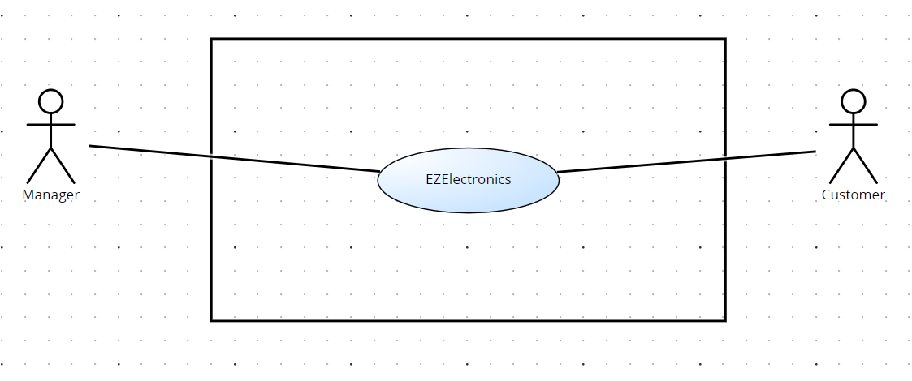
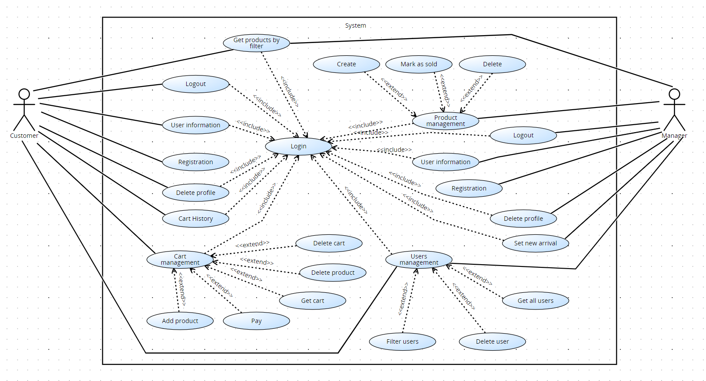
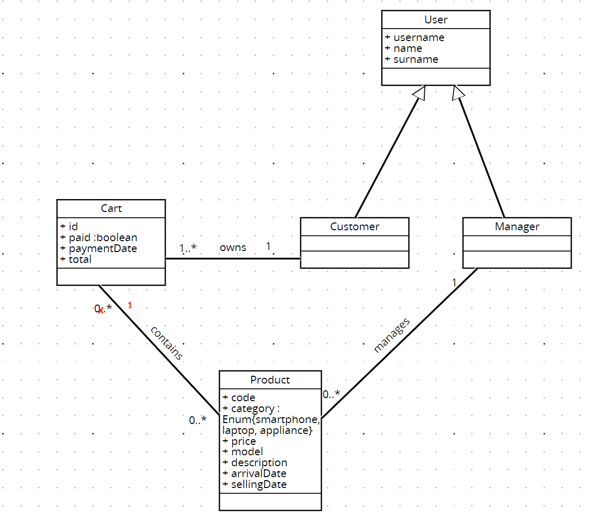
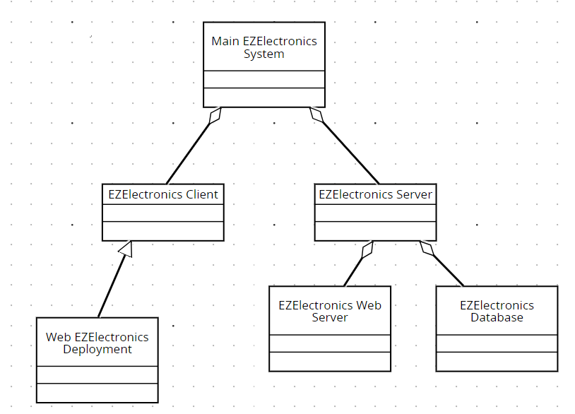
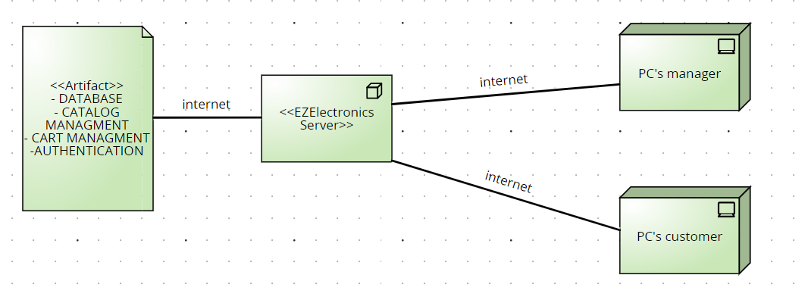

# Requirements Document - current EZElectronics

Date:

Version: V1 - description of EZElectronics in CURRENT form (as received by teachers)

| Version number | Change |
| :------------: | :----: |
|                |        |

# Contents

- [Requirements Document - current EZElectronics](#requirements-document---current-ezelectronics)
- [Contents](#contents)
- [Informal description](#informal-description)
- [Stakeholders](#stakeholders)
- [Context Diagram and interfaces](#context-diagram-and-interfaces)
  - [Context Diagram](#context-diagram)
  - [Interfaces](#interfaces)
- [Stories and personas](#stories-and-personas)
- [Functional and non functional requirements](#functional-and-non-functional-requirements)
  - [Functional Requirements](#functional-requirements)
  - [Non Functional Requirements](#non-functional-requirements)
- [Use case diagram and use cases](#use-case-diagram-and-use-cases)
  - [Use case diagram](#use-case-diagram)
    - [Use case 1, UC1: Login](#use-case-1-uc1-login)
    - [Use case 2, UC2: Registration](#use-case-2-uc2-registration)
    - [Use case 3, UC3: Delete Profile](#use-case-3-uc3-delete-profile)
    - [Use case 4, UC4: User Information](#use-case-4-uc4-user-information)
    - [Use case 5, UC5: Logout](#use-case-5-uc5-logout)
    - [Use case 6, UC6: Cart Management](#use-case-6-uc6-cart-management)
        - [Scenario 6.1: Add Product to Cart](#scenario-61-add-product-to-cart)
        - [Scenario 6.2 : Remove Product from Cart](#scenario-62--remove-product-from-cart)
        - [Scenario 6.3 : Pay the Current Cart](#scenario-63--pay-the-current-cart)
        - [Scenario 6.4 :  View Cart Details](#scenario-64---view-cart-details)
        - [Scenario 6.5 : Delete Entire Cart](#scenario-65--delete-entire-cart)
    - [Use case 7, UC7: Users Management](#use-case-7-uc7-users-management)
        - [Scenario 7.1 : Delete User](#scenario-71--delete-user)
        - [Scenario 7.2 : Get All Users](#scenario-72--get-all-users)
        - [Scenario 7.3 : Filter User List](#scenario-73--filter-user-list)
    - [Use case 8, UC8: Product Management](#use-case-8-uc8-product-management)
        - [Scenario 8.1 : Create New Product](#scenario-81--create-new-product)
        - [Scenario 8.2 : Mark Product as Sold](#scenario-82--mark-product-as-sold)
        - [Scenario 8.3 : Delete Product](#scenario-83--delete-product)
    - [Use case 9, UC9: Set new Arrival](#use-case-9-uc9-set-new-arrival)
    - [Use case 10, UC10: Get List of Products](#use-case-10-uc10-get-list-of-products)
        - [Scenario 10.1 :Filter Product List by Category or Model](#scenario-101-filter-product-list-by-category-or-model)
    - [Use case 11, UC11: View Cart History](#use-case-11-uc11-view-cart-history)
- [Glossary](#glossary)
    - [Customer](#customer)
    - [Manager](#manager)
    - [Product](#product)
    - [Inventory / Catalog](#inventory--catalog)
    - [Cart](#cart)
    - [Payment](#payment)
    - [User](#user)
    - [Authentication](#authentication)
    - [Registration](#registration)
    - [Arrival](#arrival)
    - [Filter](#filter)
- [System Design](#system-design)
- [Deployment Diagram](#deployment-diagram)

# Informal description

EZElectronics (read EaSy Electronics) is a software application designed to help managers of electronics stores to manage their products and offer them to customers through a dedicated website. Managers can assess the available products, record new ones, and confirm purchases. Customers can see available products, add them to a cart and see the history of their past purchases.

# Stakeholders

| Stakeholder name |                                                    Description                                                    |
| :--------------: | :---------------------------------------------------------------------------------------------------------------: |
|     Managers     | Responsible for managing products in their stores and interacting with the software to handle inventory and sales |
|    Customers     |                            Buyers who use the website to browse and purchase products                             |

# Context Diagram and interfaces

## Context Diagram

## Interfaces
|  Actor   |        Logical Interface         | Physical Interface |
| :------: | :------------------------------: | :----------------: |
| Manager  | GUI (Insert products and prices) |         Pc         |
| Customer |   GUI (show avaiable products)   |  Smartphone / pc   |

# Stories and personas
Manager -> She logs into EZElectronics to add a new shipment of smartphones to his store's inventory. She navigates to the product management section, enters the details of the new products, and updates the availability status. She can also confirm the purchase of the products.

Customer -> She visits the EZElectronics website to purchase a new pair of wireless headphones. She browses through the various product categories and selects her preferred headphones. She adds the item to her cart, proceeds to checkout, and completes the purchase.

# Functional and non functional requirements

## Functional Requirements

  |   ID    |               Description                |
  | :-----: | :--------------------------------------: |
  | **FR1** |          **Catalog Management**          |
  |  FR1.1  |            product management            |
  | FR1.1.1 |          creation of a product           |
  | FR1.1.2 |           mark product as sold           |
  | FR1.1.3 |       removal of a single product        |
  |  FR1.2  |             list of products             |
  | FR1.2.1 | filter the list with a specific category |
  | FR1.2.3 |  filter the list with a specific model   |
  |  FR1.3  |             set new arrival              |
  | **FR2** |          **Account Management**          |
  |  FR2.1  |                user login                |
  |  FR2.2  |               user logout                |
  |  FR2.3  |          show users information          |
  |  FR2.4  |               registration               |
  | **FR3** |           **Cart Management**            |
  |  FR3.1  |             add new products             |
  |  FR3.2  |            removal a product             |
  |  FR3.3  |            show current cart             |
  |  FR3.4  |     pay request for the current cart     |
  |  FR3.5  |        show history of the carts         |
  |  FR3.6  |    delete of the entire current cart     |
  | **FR4** |           **User management**            |
  |  FR4.1  |        delete a user by username         |
  |  FR4.2  |            list of all users             |
  | FR4.2.1 |   filter the list with a specific role   |
  | FR4.2.2 |          get user with username          |

## Non Functional Requirements

|  ID   | Type (efficiency, reliability, ..) |                                                                 Description                                                                  |      Refers to       |
| :---: | :--------------------------------: | :------------------------------------------------------------------------------------------------------------------------------------------: | :------------------: |
| NFR1  |             Efficiency             |                                          All app functionalities should complete within 0.1 seconds                                          | EZElectronics System |
| NFR2  |            Reliability             |                                  The system must be almost always available for user access (98% of cases)                                   | EZElectronics System |
| NFR3  |              Security              | All sensitive user data, such as personal information and payment data, must be encrypted to ensure security during transmission and storage | EZElectronics System |
| NFR1  |             Usability              |                                           Users should not require training to use the application                                           | EZElectronics System |
| NFR5  |            Portability             |                    The system must be compatible with a wide range of web browsers (Chrome, Firefox, Edge, Opera, Safari)                    | EZElectronics System |

# Use case diagram and use cases

## Use case diagram

### Use case 1, UC1: Login

| Actors Involved  |              Customer, Manager              |
| :--------------: | :-----------------------------------------: |
|   Precondition   | The actor must be registered in the system  |
|  Post condition  |  The actor is authenticated in the system   |
| Nominal Scenario | The user enters their username and password |
|     Variants     |                    None                     |
|    Exceptions    |         Invalid credentials entered         |

### Use case 2, UC2: Registration

| Actors Involved  |                      Customer, Manager                      |
| :--------------: | :---------------------------------------------------------: |
|   Precondition   |       The actor must not be registered in the system        |
|  Post condition  | The actor's account is created and registered in the system |
| Nominal Scenario |  The user provides necessary information for registration   |
|     Variants     |                            None                             |
|    Exceptions    |       Username or email already exists in the system        |

### Use case 3, UC3: Delete Profile

| Actors Involved  |                Customer, Manager                |
| :--------------: | :---------------------------------------------: |
|   Precondition   |      The actor has logged in successfully       |
|  Post condition  |   The actor's account is permanently deleted    |
| Nominal Scenario | The user confirms the deletion of their profile |
|     Variants     |                      None                       |
|    Exceptions    |                      None                       |

### Use case 4, UC4: User Information

| Actors Involved  |                              Customer, Manager                               |
| :--------------: | :--------------------------------------------------------------------------: |
|   Precondition   |   The actor must be logged in and have a registered profile in the system    |
|  Post condition  |                   The actor gets his personal information                    |
| Nominal Scenario | The actor moves to his personal section and obtains his personal information |
|     Variants     |                                     None                                     |
|    Exceptions    |                                     None                                     |

### Use case 5, UC5: Logout

| Actors Involved  |                 Customer, Manager                  |
| :--------------: | :------------------------------------------------: |
|   Precondition   |            The actor must be logged in             |
|  Post condition  | The actor is successfully logged out of the system |
| Nominal Scenario |       The user initiates the logout process        |
|     Variants     |                        None                        |
|    Exceptions    |                        None                        |

### Use case 6, UC6: Cart Management

| Actors Involved  |                                                           Customer                                                           |
| :--------------: | :--------------------------------------------------------------------------------------------------------------------------: |
|   Precondition   |                                                 The actor must be logged in                                                  |
|  Post condition  |                              Changes to the actor's cart are successfully applied in the system                              |
| Nominal Scenario | The actor manages his shopping cart, including adding/removing products, paying, and viewing cart details (current and past) |
|     Variants     |                                                             None                                                             |
|    Exceptions    |                                        Payment failure, adding an unavailable product                                        |

##### Scenario 6.1: Add Product to Cart
|  Scenario 6.1  |                                                                                           |
| :------------: | :---------------------------------------------------------------------------------------: |
|  Precondition  |                                   The user is logged in                                   |
| Post condition |                          The product is added to the user's cart                          |
|     Step#      |                                        Description                                        |
|       1        |                          The user navigates to the product page                           |
|       2        |                  The user selects the desired product to add to the cart                  |
|       3        |                 The user confirms the addition of the product to the cart                 |
|       4        |                    The system verifies the availability of the product                    |
|       5        | If the product is available, the system updates the user's cart with the selected product |
|       6        |                  The system displays a confirmation message to the user                   |

##### Scenario 6.2 : Remove Product from Cart
|  Scenario 6.2  |                                                                   |
| :------------: | :---------------------------------------------------------------: |
|  Precondition  |        The user is logged in and he has items in his cart         |
| Post condition |       The selected product is removed from the user's cart        |
|     Step#      |                            Description                            |
|       1        |                The user navigates to the cart page                |
|       2        |       The user selects the product to remove from the cart        |
|       3        |    The user confirms the removal of the product from the cart     |
|       4        | The system updates the user's cart, removing the selected product |
|       5        |      The system displays a confirmation message to the user       |

##### Scenario 6.3 : Pay the Current Cart
|  Scenario 6.3  |                                                                              |
| :------------: | :--------------------------------------------------------------------------: |
|  Precondition  |              The user is logged in and he has items in his cart              |
| Post condition |       The user successfully completes the payment for the current cart       |
|     Step#      |                                 Description                                  |
|       1        |                     The user navigates to the cart page                      |
|       2        |              The user selects the option to proceed to checkout              |
|       3        |                The user confirms their choice to pay in-store                |
|       4        | At the store, the user presents the order summary to the cashier for payment |
|       5        |     After payment, the user collects the purchased items from the store      |

##### Scenario 6.4 :  View Cart Details 
|  Scenario 6.3  |                                                                                      |
| :------------: | :----------------------------------------------------------------------------------: |
|  Precondition  |                  The user is logged in and he has items in his cart                  |
| Post condition |                   The user views the details of their current cart                   |
|     Step#      |                                     Description                                      |
|       1        |                         The user navigates to the cart page                          |
|       2        |                    The user's current cart details are displayed                     |
|       3        | The user can view the list of products in the cart, along with quantities and prices |

##### Scenario 6.5 : Delete Entire Cart
|  Scenario 6.3  |                                                        |
| :------------: | :----------------------------------------------------: |
|  Precondition  |   The user is logged in and he has items in his cart   |
| Post condition |           The user's entire cart is cleared            |
|     Step#      |                      Description                       |
|       1        |          The user navigates to the cart page           |
|       2        | The user selects the option to delete the entire cart  |
|       3        |   The user confirms the deletion of the entire cart    |
|       4        |           The system clears the user's cart            |
|       5        | The system displays a confirmation message to the user |

### Use case 7, UC7: Users Management
| Actors Involved  |                                             Manager, Customer                                              |
| :--------------: | :--------------------------------------------------------------------------------------------------------: |
|   Precondition   |                                      The actor must be authenticated                                       |
|  Post condition  |                           Changes to the user accounts are successfully applied                            |
| Nominal Scenario | The actor manages users, including deleting users and filtering the user list by username or specific role |
|     Variants     |                                                    None                                                    |
|    Exceptions    |                                     Invalid user input or system error                                     |

##### Scenario 7.1 : Delete User
|  Scenario 7.1  |                                                          |
| :------------: | :------------------------------------------------------: |
|  Precondition  |                The actor is authenticated                |
| Post condition |        The specified user is successfully deleted        |
|     Step#      |                       Description                        |
|       1        |    The actor navigates to the user management section    |
|       2        |      The actor selects the option to delete a user       |
|       3        |   The actor enters the username of the user to delete    |
|       4        |       The actor confirms the deletion of the user        |
|       5        |  The actor removes the specified user from the database  |
|       6        | The actor displays a confirmation message to the manager |

##### Scenario 7.2 : Get All Users
|  Scenario 7.2  |                                                                                                                        |
| :------------: | :--------------------------------------------------------------------------------------------------------------------: |
|  Precondition  |                                       The actor is authenticated and authorized                                        |
| Post condition |                                                Get the entire user list                                                |
|     Step#      |                                                      Description                                                       |
|       1        |                                   The actor navigates to the user management section                                   |
|       2        |                                     The actor selects the option to view the list                                      |
|       3        |                              The system gets the complete list of users from the database                              |
|       4        | The system displays the list of users to the manager, including their usernames, roles, and other relevant information |

##### Scenario 7.3 : Filter User List
|  Scenario 7.3  |                                                                                       |
| :------------: | :-----------------------------------------------------------------------------------: |
|  Precondition  |                       The actor is authenticated and authorized                       |
| Post condition |                              Get the filtered user list                               |
|     Step#      |                                      Description                                      |
|       1        |                  The actor navigates to the user management section                   |
|       2        |                         The actor gets the list of all users                          |
|       3        |                 The actor selects the option to filter the user list                  |
|       4        | The actor enters the criteria to filter the user list (Ex: username or specific role) |
|       5        |                  The system gets and displays the filtered user list                  |
|       6        |                      The actoor can view the filtered user list                       |
 
### Use case 8, UC8: Product Management
| Actors Involved  |                                   Manager                                   |
| :--------------: | :-------------------------------------------------------------------------: |
|   Precondition   |               The actor must be authenticated and authorized                |
|  Post condition  |                     Changes to the products are applied                     |
| Nominal Scenario | The manager manages products, including creating, marking as sold, deleting |
|     Variants     |                                    None                                     |
|    Exceptions    |                        Invalid input or system error                        |

##### Scenario 8.1 : Create New Product
|  Scenario 8.1  |                                                                                                   |
| :------------: | :-----------------------------------------------------------------------------------------------: |
|  Precondition  |                            The manager is authenticated and authorized                            |
| Post condition |                        The new product is successfully added to the system                        |
|     Step#      |                                            Description                                            |
|       1        |                      The manager navigates to the product management section                      |
|       2        |                        The manager selects the option to add a new product                        |
|       3        | The manager enters the details of the new product (Ex: name, description, category, model, price) |
|       4        |                       The manager confirms the addition of the new product                        |
|       5        |                      The system adds the new product to the product database                      |
|       6        |                     The system displays a confirmation message to the manager                     |

##### Scenario 8.2 : Mark Product as Sold
|  Scenario 8.2  |                                                                                          |
| :------------: | :--------------------------------------------------------------------------------------: |
|  Precondition  |                       The manager is authenticated and authorized                        |
| Post condition |                  The specified product is marked as sold in the system                   |
|     Step#      |                                       Description                                        |
|       1        |                 The manager navigates to the product management section                  |
|       2        |                 The manager selects the option to mark a product as sold                 |
|       3        | The manager enters the details of the product to mark as sold (Ex: product ID or name).  |
|       4        |               The manager confirms the action to mark the product as sold                |
|       5        | The system updates the status of the specified product to "sold" in the product database |
|       6        |                The system displays a confirmation message to the manager                 |

##### Scenario 8.3 : Delete Product
|  Scenario 8.3  |                                                                                          |
| :------------: | :--------------------------------------------------------------------------------------: |
|  Precondition  |                       The manager is authenticated and authorized                        |
| Post condition |                  The specified product is marked as sold in the system                   |
|     Step#      |                                       Description                                        |
|       1        |                 The manager navigates to the product management section                  |
|       2        |                 The manager selects the option to mark a product as sold                 |
|       3        | The manager enters the details of the product to mark as sold (Ex: product ID or name).  |
|       4        |               The manager confirms the action to mark the product as sold                |
|       5        | The system updates the status of the specified product to "sold" in the product database |
|       6        |                The system displays a confirmation message to the manager                 |

### Use case 9, UC9: Set new Arrival
| Actors Involved  |                                          Manager                                           |
| :--------------: | :----------------------------------------------------------------------------------------: |
|   Precondition   |                                The actor must be logged in                                 |
|  Post condition  |                     The actor add a new set of products in the catalog                     |
| Nominal Scenario | The manager accesses the area for managing new arrivals of products and adds a new arrival |
|     Variants     |                                            None                                            |
|    Exceptions    |                                        System error                                        |

### Use case 10, UC10: Get List of Products
| Actors Involved  |                                       Manager, Customer                                       |
| :--------------: | :-------------------------------------------------------------------------------------------: |
|   Precondition   |                                  The actor must be logged in                                  |
|  Post condition  |                     The actor successfully gets the list of all products                      |
| Nominal Scenario | The actor select a certain filte and obtain the corresponding list (Ex: all, category, model) |
|     Variants     |                                             None                                              |
|    Exceptions    |             Invalid input (Ex: inexistent category or model,...) or system error              |

##### Scenario 10.1 :Filter Product List by Category or Model
| Scenario 10.1  |                                                                                  |
| :------------: | :------------------------------------------------------------------------------: |
|  Precondition  |                           The acotr must be logged in                            |
| Post condition | The actor successfully filters the product list based on the specified criteria  |
|     Step#      |                                   Description                                    |
|       1        |                   The actor navigates to the products section                    |
|       2        |             The actor selects the option to filter the product list              |
|       3        | The actor enters the criteria to filter the product list (Ex: category or model) |
|       4        |                   The actor can view the filtered product list                   |

### Use case 11, UC11: View Cart History
| Actors Involved  |                                    Customer                                     |
| :--------------: | :-----------------------------------------------------------------------------: |
|   Precondition   |                       The user has at least one past cart                       |
|  Post condition  |                  The user successfully views his carts history                  |
| Nominal Scenario | The user accesses the cart history section and views a list of their past carts |
|     Variants     |                                      None                                       |
|    Exceptions    |                     No cart history available, system error                     |

# Glossary
### Customer
A person who uses the EZElectronics website to browse and purchase products

### Manager
A person responsible for managing products in their store and interacting with the software to handle inventory and sales

### Product
An item available for purchase on the EZElectronics website, such as smartphones, headphones, computers, etc..

### Inventory / Catalog
A comprehensive list of all products available in the EZElectronics system, managed by managers

### Cart
A feature of the EZElectronics system that allows customers to collect and manage the products they wish to purchase.

### Payment
The process through which customers make payments for items in their cart

### User
A person registered in the EZElectronics system, who can be a customer or a manager

### Authentication
The process of verifying a user's identity, typically through the use of credentials such as username and password

### Registration
The process through which a new user registers in the EZElectronics system, providing the necessary information to create an account

### Arrival
A new set of products available on the EZElectronics website, which is added to the existing catalog

### Filter
An option that allows users to view only products that match certain criteria, such as category or model

# System Design

# Deployment Diagram
