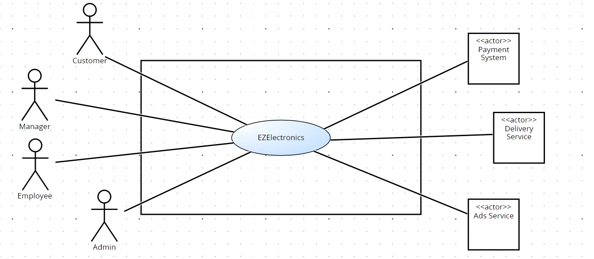
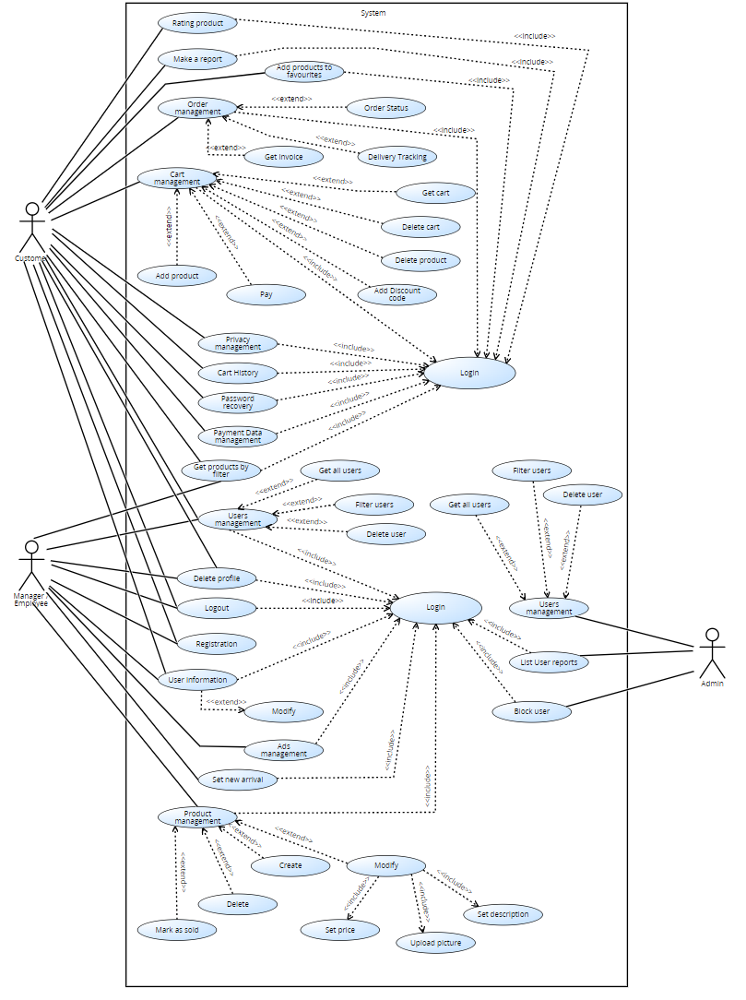
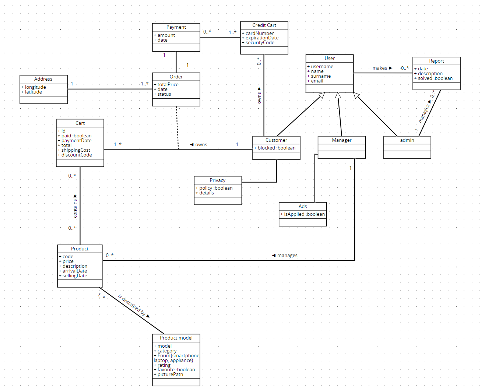
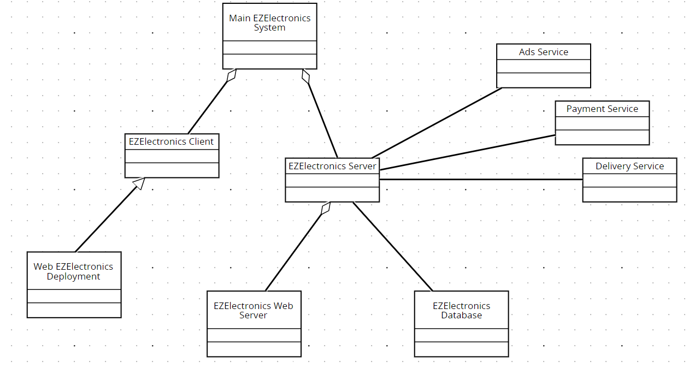
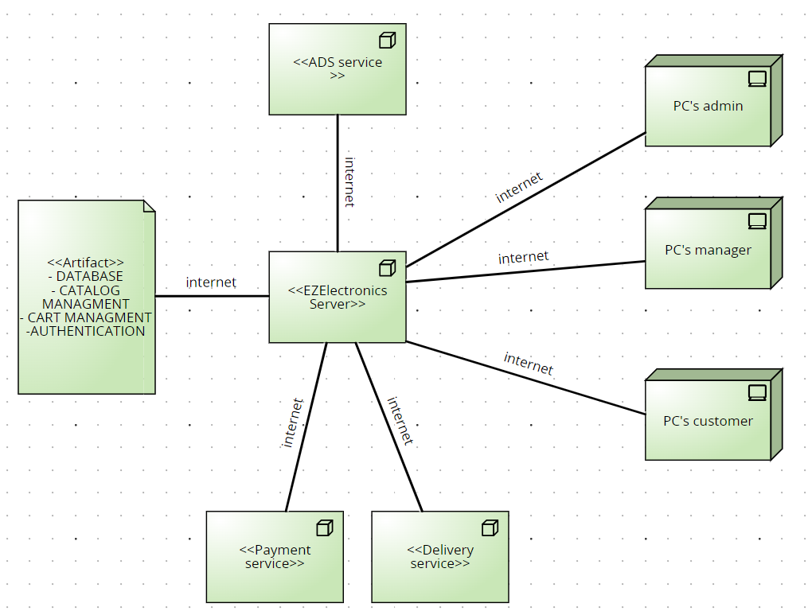

# Requirements Document - future EZElectronics

Date:

Version: V1 - description of EZElectronics in FUTURE form (as proposed by the team)

| Version number | Change |
| :------------: | :----: |
|                |        |

# Contents

- [Requirements Document - future EZElectronics](#requirements-document---future-ezelectronics)
- [Contents](#contents)
- [Informal description](#informal-description)
- [Stakeholders](#stakeholders)
- [Context Diagram and interfaces](#context-diagram-and-interfaces)
  - [Context Diagram](#context-diagram)
  - [Interfaces](#interfaces)
- [Stories and personas](#stories-and-personas)
- [Functional and non functional requirements](#functional-and-non-functional-requirements)
  - [Functional Requirements](#functional-requirements)
  - [Non Functional Requirements](#non-functional-requirements)
- [Use case diagram and use cases](#use-case-diagram-and-use-cases)
  - [Use case diagram](#use-case-diagram)
    - [Use case 1, UC1: Login](#use-case-1-uc1-login)
    - [Use case 2, UC2: Registration](#use-case-2-uc2-registration)
    - [Use case 3, UC3: Delete Profile](#use-case-3-uc3-delete-profile)
    - [Use case 4, UC4: User Information](#use-case-4-uc4-user-information)
    - [Use case 5, UC5: Logout](#use-case-5-uc5-logout)
    - [Use case 6, UC6: Cart Management](#use-case-6-uc6-cart-management)
        - [Scenario 6.1: Add Product to Cart](#scenario-61-add-product-to-cart)
        - [Scenario 6.2 : Remove Product from Cart](#scenario-62--remove-product-from-cart)
        - [Scenario 6.3 : Pay the Current Cart](#scenario-63--pay-the-current-cart)
        - [Scenario 6.4 :  View Cart Details](#scenario-64---view-cart-details)
        - [Scenario 6.5 : Delete Entire Cart](#scenario-65--delete-entire-cart)
        - [Scenario 6.6 : Modify Number of Products](#scenario-66--modify-number-of-products)
        - [Scenario 6.7 : Order Total and Shipping Costs](#scenario-67--order-total-and-shipping-costs)
        - [Scenario 6.8 : Add Discount Code](#scenario-68--add-discount-code)
    - [Use case 7, UC7: Users Management](#use-case-7-uc7-users-management)
        - [Scenario 7.1 : Delete User](#scenario-71--delete-user)
        - [Scenario 7.2 : Get All Users](#scenario-72--get-all-users)
        - [Scenario 7.3 : Filter User List](#scenario-73--filter-user-list)
        - [Scenario 7.4 : Show User's reports](#scenario-74--show-users-reports)
        - [Scenario 7.4 : Block a User](#scenario-74--block-a-user)
    - [Use case 8, UC8: Product Management](#use-case-8-uc8-product-management)
        - [Scenario 8.1 : Create New Product](#scenario-81--create-new-product)
        - [Scenario 8.2 : Mark Product as Sold](#scenario-82--mark-product-as-sold)
        - [Scenario 8.3 : Delete Product](#scenario-83--delete-product)
    - [Use case 9, UC9: Set new Arrival](#use-case-9-uc9-set-new-arrival)
    - [Use case 10, UC10: Get List of Products](#use-case-10-uc10-get-list-of-products)
        - [Scenario 10.1 : Filter Product List by Category or Model](#scenario-101--filter-product-list-by-category-or-model)
    - [Use case 11, UC11: View Cart History](#use-case-11-uc11-view-cart-history)
    - [Use case 12, UC12: Modify a Product](#use-case-12-uc12-modify-a-product)
        - [Scenario 12.1 : Defining Price](#scenario-121--defining-price)
        - [Scenario 12.2 : Insert Description](#scenario-122--insert-description)
        - [Scenario 12.3 : Loading Picture](#scenario-123--loading-picture)
    - [Use case 13, UC13: Modify Personal Information](#use-case-13-uc13-modify-personal-information)
    - [Use case 14, UC14: Payment Data Management](#use-case-14-uc14-payment-data-management)
    - [Use case 15, UC15: Privacy Management](#use-case-15-uc15-privacy-management)
    - [Use case 16, UC16: Ads Management](#use-case-16-uc16-ads-management)
    - [Use case 17, UC17 : Order Management](#use-case-17-uc17--order-management)
    - [Use case 18, UC18 : Rate a Product](#use-case-18-uc18--rate-a-product)
    - [Use case 19, UC19 : Make a Report](#use-case-19-uc19--make-a-report)
    - [Use case 20, UC20 :Add Product to Favorites](#use-case-20-uc20-add-product-to-favorites)
    - [Use case 21, UC21: Password Recoery](#use-case-21-uc21-password-recoery)
- [Glossary](#glossary)
    - [Customer](#customer)
    - [Manager](#manager)
    - [Admin](#admin)
    - [Product](#product)
    - [Inventory / Catalog](#inventory--catalog)
    - [Cart](#cart)
    - [Payment](#payment)
    - [User](#user)
    - [Authentication](#authentication)
    - [Registration](#registration)
    - [Arrival](#arrival)
    - [Filter](#filter)
    - [Password](#password)
    - [Report](#report)
    - [Rate](#rate)
    - [Order](#order)
    - [Ads](#ads)
    - [Privacy](#privacy)
    - [Block](#block)
- [Classe catalogo?](#classe-catalogo)
- [System Design](#system-design)
- [Deployment Diagram](#deployment-diagram)

# Informal description

EZElectronics (read EaSy Electronics) is a software application designed to help managers of electronics stores to manage their products and offer them to customers through a dedicated website. Managers can assess the available products, record new ones, and confirm purchases. Customers can see available products, add them to a cart and see the history of their past purchases.

# Stakeholders

|      Stakeholder name      |                                                    Description                                                    |
| :------------------------: | :---------------------------------------------------------------------------------------------------------------: |
| Electronics store managers | Responsible for managing products in their stores and interacting with the software to handle inventory and sales |
|      Store employees       |              They are responsible for updating the inventory or assisting customers during purchase               |
|          Clients           |                            Buyers who use the website to browse and purchase products                             |
|         SW Factory         |             Anyone involved in the development and maintenance of the dedicated website for customers             |
|           Admin            |            They ensure the proper functioning, security, and compliance of the system with regulations            |
| Payment service providers  |             Companies that offer platforms or infrastructures to enable online financial transactions             |
|        Servizio ads        |                                      Support for advertising on the website                                       |
|      Delivery service      |    External entity involved in the physical delivery of products purchased by customers through EZElectronics     |

# Context Diagram and interfaces

## Context Diagram

## Interfaces

|       Actor        |                    Logical Interface                    | Physical Interface |
| :----------------: | :-----------------------------------------------------: | :----------------: |
| Manager / Employee |            GUI (Insert products and prices)             |         Pc         |
|       Client       |              GUI (show avaiable products)               |  Smartphone / pc   |
|       Admin        |      GUI (Account management and customer support)      |         Pc         |
|    Service ads     | https://developers.google.com/google-ads/api/docs/start |      Internet      |
|  Payment service   |                 paypal / satispay / ...                 |      Internet      |
|  Delivery service  |      API for interacting with the delivery service      |      Internet      |

# Stories and personas

Manager -> She logs into EZElectronics to add a new shipment of smartphones to her store's inventory. She navigates to the product management section, enters the details of the new products, and updates the availability status.

Employee ->  He receives a customer request about the availability of a specific laptop model. He accesses EZElectronics on his smartphone, checks the inventory status, and informs the customer about the product's availability.

Client -> She visits the EZElectronics website to purchase a new pair of wireless headphones. She browses through the various product categories, reads reviews from other customers, and selects her preferred headphones. She adds the item to her cart, proceeds to checkout, and completes the purchase securely using her preferred payment method.

Admin -> He receives a customer feedback reporting a checkout process glitch. He communicates it to the development team, and ensures the customer receives updates on the resolution progress.

# Functional and non functional requirements

## Functional Requirements

|    ID     |                   Description                    |
| :-------: | :----------------------------------------------: |
|  **FR1**  |              **Catalog Management**              |
|   FR1.1   |                product management                |
|  FR1.1.1  |              creation of a product               |
|  FR1.1.2  |               mark product as sold               |
|  FR1.1.3  |               removal of a product               |
|  FR1.1.4  |                 modify a product                 |
| FR1.1.4.1 |                  defining price                  |
| FR1.1.4.2 |                 loading picture                  |
| FR1.1.4.3 |                insert description                |
|   FR1.2   |                 list of products                 |
|  FR1.2.1  |     filter the list with a specific category     |
|  FR1.2.3  |      filter the list with a specific model       |
|   FR1.3   |                 set new arrival                  |
|  **FR2**  |              **Account Management**              |
|   FR2.1   |                    user login                    |
|   FR2.2   |                   user logout                    |
|   FR2.3   |              show users information              |
|  FR2.3.1  |           modify personal information            |
|   FR2.4   |                   registration                   |
|   FR2.5   |        password recovery for user account        |
|  **FR3**  |               **User management**                |
|   FR3.1   |            delete a user by username             |
|   FR3.2   |                list of all users                 |
|  FR3.2.1  |       filter the list with a specific role       |
|  FR3.2.2  |              get user with username              |
|   FR3.3   |               show user's reports                |
|   FR3.4   |                   block a user                   |
|  **FR4**  |              **Payment Management**              |
|   FR4.1   |                 payment request                  |
|   FR4.2   |             payment data management              |
|  **FR5**  |              **Privacy Management**              |
|   FR5.1   |                show cookie policy                |
|   FR5.2   | management of user access rights and permissions |
|  **FR6**  |                **Ads Management**                |
|   FR6.1   |              show/hide ad on screen              |
|  **FR7**  |               **Cart Management**                |
|   FR7.1   |                 add new product                  |
|   FR7.2   |                removal a product                 |
|   FR7.3   |             modify number of product             |
|   FR7.4   |                show current cart                 |
|   FR7.5   |         pay request for the current cart         |
|   FR7.6   |            show history of the carts             |
|   FR7.7   |        delete of the entire current cart         |
|   FR7.8   |       show order total and shipping costs        |
|   FR7.9   |                add discount code                 |
|  **FR8**  |               **Order Management**               |
|   FR8.1   |             display of order status              |
|   FR8.2   |       generation of invoices and receipts        |
|   FR8.3   |              show delivery tracking              |
|  **FR9**  |                **User Interface**                |
|   FR9.1   |                 rating products                  |
|   FR9.2   |                  make a report                   |
|   FR9.3   |            add products to favorites             |

## Non Functional Requirements

|  ID   | Type (efficiency, reliability, ..) |                                                                 Description                                                                  |      Refers to       |
| :---: | :--------------------------------: | :------------------------------------------------------------------------------------------------------------------------------------------: | :------------------: |
| NFR1  |             Efficiency             |                                          All app functionalities should complete within 0.1 seconds                                          | EZElectronics System |
| NFR2  |            Reliability             |                                  The system must be almost always available for user access (98% of cases)                                   | EZElectronics System |
| NFR3  |              Security              | All sensitive user data, such as personal information and payment data, must be encrypted to ensure security during transmission and storage | EZElectronics System |
| NFR1  |             Usability              |                                           Users should not require training to use the application                                           | EZElectronics System |
| NFR5  |            Portability             |                    The system must be compatible with a wide range of web browsers (Chrome, Firefox, Edge, Opera, Safari)                    | EZElectronics System |

# Use case diagram and use cases

## Use case diagram

### Use case 1, UC1: Login

| Actors Involved  |              Customer, Manager              |
| :--------------: | :-----------------------------------------: |
|   Precondition   | The actor must be registered in the system  |
|  Post condition  |  The actor is authenticated in the system   |
| Nominal Scenario | The user enters their username and password |
|     Variants     |                    None                     |
|    Exceptions    |         Invalid credentials entered         |

### Use case 2, UC2: Registration

| Actors Involved  |                      Customer, Manager                      |
| :--------------: | :---------------------------------------------------------: |
|   Precondition   |       The actor must not be registered in the system        |
|  Post condition  | The actor's account is created and registered in the system |
| Nominal Scenario |  The user provides necessary information for registration   |
|     Variants     |                            None                             |
|    Exceptions    |       Username or email already exists in the system        |

### Use case 3, UC3: Delete Profile

| Actors Involved  |                     Manager                     |
| :--------------: | :---------------------------------------------: |
|   Precondition   |      The actor has logged in successfully       |
|  Post condition  |   The actor's account is permanently deleted    |
| Nominal Scenario | The user confirms the deletion of their profile |
|     Variants     |                      None                       |
|    Exceptions    |                      None                       |

### Use case 4, UC4: User Information

| Actors Involved  |                              Customer, Manager                               |
| :--------------: | :--------------------------------------------------------------------------: |
|   Precondition   |   The actor must be logged in and have a registered profile in the system    |
|  Post condition  |                   The actor gets his personal information                    |
| Nominal Scenario | The actor moves to his personal section and obtains his personal information |
|     Variants     |                                     None                                     |
|    Exceptions    |                                     None                                     |

### Use case 5, UC5: Logout

| Actors Involved  |                 Customer, Manager                  |
| :--------------: | :------------------------------------------------: |
|   Precondition   |            The actor must be logged in             |
|  Post condition  | The actor is successfully logged out of the system |
| Nominal Scenario |       The user initiates the logout process        |
|     Variants     |                        None                        |
|    Exceptions    |                        None                        |

### Use case 6, UC6: Cart Management

| Actors Involved  |                                                           Customer                                                           |
| :--------------: | :--------------------------------------------------------------------------------------------------------------------------: |
|   Precondition   |                                                 The actor must be logged in                                                  |
|  Post condition  |                              Changes to the actor's cart are successfully applied in the system                              |
| Nominal Scenario | The actor manages his shopping cart, including adding/removing products, paying, and viewing cart details (current and past) |
|     Variants     |                                                             None                                                             |
|    Exceptions    |                                        Payment failure, adding an unavailable product                                        |

##### Scenario 6.1: Add Product to Cart
|  Scenario 6.1  |                                                                                           |
| :------------: | :---------------------------------------------------------------------------------------: |
|  Precondition  |                                   The user is logged in                                   |
| Post condition |                          The product is added to the user's cart                          |
|     Step#      |                                        Description                                        |
|       1        |                          The user navigates to the product page                           |
|       2        |                  The user selects the desired product to add to the cart                  |
|       3        |                 The user confirms the addition of the product to the cart                 |
|       4        |                    The system verifies the availability of the product                    |
|       5        | If the product is available, the system updates the user's cart with the selected product |
|       6        |                  The system displays a confirmation message to the user                   |

##### Scenario 6.2 : Remove Product from Cart
|  Scenario 6.2  |                                                                   |
| :------------: | :---------------------------------------------------------------: |
|  Precondition  |        The user is logged in and he has items in his cart         |
| Post condition |       The selected product is removed from the user's cart        |
|     Step#      |                            Description                            |
|       1        |                The user navigates to the cart page                |
|       2        |       The user selects the product to remove from the cart        |
|       3        |    The user confirms the removal of the product from the cart     |
|       4        | The system updates the user's cart, removing the selected product |
|       5        |      The system displays a confirmation message to the user       |

##### Scenario 6.3 : Pay the Current Cart
|  Scenario 6.3  |                                                                                            |
| :------------: | :----------------------------------------------------------------------------------------: |
|  Precondition  |                     The user is logged in and he has items in his cart                     |
| Post condition |              The user successfully completes the payment for the current cart              |
|     Step#      |                                        Description                                         |
|       1        |                            The user navigates to the cart page                             |
|       2        |                     The user selects the option to proceed to checkout                     |
|       3        | The user enters all the data necessary to proceed with the payment and confirm the payment |
|       4        |      If payment is successful, the system displays a payment confirmation to the user      |
|       5        |   If payment fails, the system displays an error message indicating the payment failure    |

##### Scenario 6.4 :  View Cart Details 
|  Scenario 6.4  |                                                                                      |
| :------------: | :----------------------------------------------------------------------------------: |
|  Precondition  |                  The user is logged in and he has items in his cart                  |
| Post condition |                   The user views the details of their current cart                   |
|     Step#      |                                     Description                                      |
|       1        |                         The user navigates to the cart page                          |
|       2        |                    The user's current cart details are displayed                     |
|       3        | The user can view the list of products in the cart, along with quantities and prices |

##### Scenario 6.5 : Delete Entire Cart
|  Scenario 6.5  |                                                        |
| :------------: | :----------------------------------------------------: |
|  Precondition  |   The user is logged in and he has items in his cart   |
| Post condition |           The user's entire cart is cleared            |
|     Step#      |                      Description                       |
|       1        |          The user navigates to the cart page           |
|       2        | The user selects the option to delete the entire cart  |
|       3        |   The user confirms the deletion of the entire cart    |
|       4        |           The system clears the user's cart            |
|       5        | The system displays a confirmation message to the user |

##### Scenario 6.6 : Modify Number of Products
|  Scenario 6.6  |                                                                                   |
| :------------: | :-------------------------------------------------------------------------------: |
|  Precondition  |                      The user must have items in their cart                       |
| Post condition |            The number of products in the cart is successfully updated             |
|     Step#      |                                    Description                                    |
|       1        |   The user navigates to the cart summary section to review their selected items   |
|       2        |         The user selects the product they wish to modify the quantity for         |
|       3        | The user updates the quantity of the selected product using the provided controls |
|       4        |  The system recalculates the subtotal for the product based on the new quantity   |
|       5        |    The user reviews the changes and proceeds to checkout or continues shopping    |

##### Scenario 6.7 : Order Total and Shipping Costs

|  Scenario 6.7  |                                                                                     |
| :------------: | :---------------------------------------------------------------------------------: |
|  Precondition  |           The user must have items in their cart and proceed to checkout            |
| Post condition |        The user successfully views the order total including shipping costs         |
|     Step#      |                                     Description                                     |
|       1        |      The user navigates to the checkout section to review their order details       |
|       2        |            The system calculates the subtotal for all items in the cart             |
|       3        |             The system adds shipping costs based on the user's location             |
|       4        | The user reviews the order total, including shipping costs, and proceeds to payment |

##### Scenario 6.8 : Add Discount Code

|  Scenario 6.8  |                                                                                     |
| :------------: | :---------------------------------------------------------------------------------: |
|  Precondition  |           The user must have items in their cart and proceed to checkout            |
| Post condition |   The user successfully applies a discount code and views the updated order total   |
|     Step#      |                                     Description                                     |
|       1        |      The user navigates to the checkout section to review their order details       |
|       2        |             The user enters the discount code into the designated field             |
|       3        |     The system validates the discount code and applies the associated discount      |
|       4        | The system updates the order total to reflect the discounted amount, if applicable  |
|       5        | The user reviews the updated order total, completes the checkout, and makes payment |

### Use case 7, UC7: Users Management
| Actors Involved  |                                               Manager, Admin                                               |
| :--------------: | :--------------------------------------------------------------------------------------------------------: |
|   Precondition   |                                      The actor must be authenticated                                       |
|  Post condition  |                           Changes to the user accounts are successfully applied                            |
| Nominal Scenario | The actor manages users, including deleting users and filtering the user list by username or specific role |
|     Variants     |                                                    None                                                    |
|    Exceptions    |                                     Invalid user input or system error                                     |

##### Scenario 7.1 : Delete User
|  Scenario 7.1  |                                                          |
| :------------: | :------------------------------------------------------: |
|  Precondition  |                The actor is authenticated                |
| Post condition |        The specified user is successfully deleted        |
|     Step#      |                       Description                        |
|       1        |    The actor navigates to the user management section    |
|       2        |      The actor selects the option to delete a user       |
|       3        |   The actor enters the username of the user to delete    |
|       4        |       The actor confirms the deletion of the user        |
|       5        |  The actor removes the specified user from the database  |
|       6        | The actor displays a confirmation message to the manager |

##### Scenario 7.2 : Get All Users
|  Scenario 7.2  |                                                                                                                        |
| :------------: | :--------------------------------------------------------------------------------------------------------------------: |
|  Precondition  |                                       The actor is authenticated and authorized                                        |
| Post condition |                                                Get the entire user list                                                |
|     Step#      |                                                      Description                                                       |
|       1        |                                   The actor navigates to the user management section                                   |
|       2        |                                     The actor selects the option to view the list                                      |
|       3        |                              The system gets the complete list of users from the database                              |
|       4        | The system displays the list of users to the manager, including their usernames, roles, and other relevant information |

##### Scenario 7.3 : Filter User List
|  Scenario 7.3  |                                                                                       |
| :------------: | :-----------------------------------------------------------------------------------: |
|  Precondition  |                       The actor is authenticated and authorized                       |
| Post condition |                              Get the filtered user list                               |
|     Step#      |                                      Description                                      |
|       1        |                  The actor navigates to the user management section                   |
|       2        |                         The actor gets the list of all users                          |
|       3        |                 The actor selects the option to filter the user list                  |
|       4        | The actor enters the criteria to filter the user list (Ex: username or specific role) |
|       5        |                  The system gets and displays the filtered user list                  |
|       6        |                       The actor can view the filtered user list                       |

##### Scenario 7.4 : Show User's reports
|  Scenario 7.4  |                                                                                     |
| :------------: | :---------------------------------------------------------------------------------: |
|  Precondition  | The user must be logged in and have the necessary permissions (role: Manager/Admin) |
| Post condition |          The admin successfully views all reports and relevant information          |
|     Step#      |                                     Description                                     |
|       1        |       The admin navigates to the  user management section for viewing reports       |
|       2        |                 The admin selects the option to view user's reports                 |
|       3        |                The system retrieves and displays the user's reports                 |
|       4        |                          The admin can review the reports                           |

##### Scenario 7.4 : Block a User
|  Scenario 7.4  |                                                                                          |
| :------------: | :--------------------------------------------------------------------------------------: |
|  Precondition  | The admin must be authenticated and have the necessary permissions (role: Manager/Admin) |
| Post condition |          The user has been successfully blocked and cannot access their account          |
|     Step#      |                                       Description                                        |
|       1        |                      The admin accesses the user management section                      |
|       2        |                   The administrator selects the option to block a user                   |
|       3        |    The system confirms the decision to block the user and updates the account status     |
|       4        |                      The administrator views a confirmation message                      |

 
### Use case 8, UC8: Product Management
| Actors Involved  |                                   Manager                                   |
| :--------------: | :-------------------------------------------------------------------------: |
|   Precondition   |               The actor must be authenticated and authorized                |
|  Post condition  |                     Changes to the products are applied                     |
| Nominal Scenario | The manager manages products, including creating, marking as sold, deleting |
|     Variants     |                                    None                                     |
|    Exceptions    |                        Invalid input or system error                        |

##### Scenario 8.1 : Create New Product
|  Scenario 8.1  |                                                                                                   |
| :------------: | :-----------------------------------------------------------------------------------------------: |
|  Precondition  |                            The manager is authenticated and authorized                            |
| Post condition |                        The new product is successfully added to the system                        |
|     Step#      |                                            Description                                            |
|       1        |                      The manager navigates to the product management section                      |
|       2        |                        The manager selects the option to add a new product                        |
|       3        | The manager enters the details of the new product (Ex: name, description, category, model, price) |
|       4        |                       The manager confirms the addition of the new product                        |
|       5        |                      The system adds the new product to the product database                      |
|       6        |                     The system displays a confirmation message to the manager                     |

##### Scenario 8.2 : Mark Product as Sold
|  Scenario 8.2  |                                                                                          |
| :------------: | :--------------------------------------------------------------------------------------: |
|  Precondition  |                       The manager is authenticated and authorized                        |
| Post condition |                  The specified product is marked as sold in the system                   |
|     Step#      |                                       Description                                        |
|       1        |                 The manager navigates to the product management section                  |
|       2        |                 The manager selects the option to mark a product as sold                 |
|       3        | The manager enters the details of the product to mark as sold (Ex: product ID or name).  |
|       4        |               The manager confirms the action to mark the product as sold                |
|       5        | The system updates the status of the specified product to "sold" in the product database |
|       6        |                The system displays a confirmation message to the manager                 |

##### Scenario 8.3 : Delete Product
|  Scenario 8.3  |                                                                                          |
| :------------: | :--------------------------------------------------------------------------------------: |
|  Precondition  |                       The manager is authenticated and authorized                        |
| Post condition |                  The specified product is marked as sold in the system                   |
|     Step#      |                                       Description                                        |
|       1        |                 The manager navigates to the product management section                  |
|       2        |                 The manager selects the option to mark a product as sold                 |
|       3        | The manager enters the details of the product to mark as sold (Ex: product ID or name).  |
|       4        |               The manager confirms the action to mark the product as sold                |
|       5        | The system updates the status of the specified product to "sold" in the product database |
|       6        |                The system displays a confirmation message to the manager                 |

### Use case 9, UC9: Set new Arrival
| Actors Involved  |                                          Manager                                           |
| :--------------: | :----------------------------------------------------------------------------------------: |
|   Precondition   |                                The actor must be logged in                                 |
|  Post condition  |                     The actor add a new set of products in the catalog                     |
| Nominal Scenario | The manager accesses the area for managing new arrivals of products and adds a new arrival |
|     Variants     |                                            None                                            |
|    Exceptions    |                                        System error                                        |

### Use case 10, UC10: Get List of Products
| Actors Involved  |                                       Manager, Customer                                        |
| :--------------: | :--------------------------------------------------------------------------------------------: |
|   Precondition   |                                  The actor must be logged in                                   |
|  Post condition  |                      The actor successfully gets the list of all products                      |
| Nominal Scenario | The actor select a certain filter and obtain the corresponding list (Ex: all, category, model) |
|     Variants     |                                              None                                              |
|    Exceptions    |              Invalid input (Ex: inexistent category or model,...) or system error              |

##### Scenario 10.1 : Filter Product List by Category or Model
| Scenario 10.1  |                                                                                  |
| :------------: | :------------------------------------------------------------------------------: |
|  Precondition  |                           The acotr must be logged in                            |
| Post condition | The actor successfully filters the product list based on the specified criteria  |
|     Step#      |                                   Description                                    |
|       1        |              The actor navigates to the products section (HomePage)              |
|       2        |             The actor selects the option to filter the product list              |
|       3        | The actor enters the criteria to filter the product list (Ex: category or model) |
|       4        |                   The actor can view the filtered product list                   |

### Use case 11, UC11: View Cart History
| Actors Involved  |                                    Customer                                     |
| :--------------: | :-----------------------------------------------------------------------------: |
|   Precondition   |                       The user has at least one past cart                       |
|  Post condition  |                  The user successfully views his carts history                  |
| Nominal Scenario | The user accesses the cart history section and views a list of their past carts |
|     Variants     |                                      None                                       |
|    Exceptions    |                     No cart history available, system error                     |

### Use case 12, UC12: Modify a Product
| Actors Involved  |                                 Manager                                 |
| :--------------: | :---------------------------------------------------------------------: |
|   Precondition   |             The manager must be authenticated in the system             |
|  Post condition  |     The changes to the product are successfully saved in the system     |
| Nominal Scenario | The manager modify a product by changing picture, description and price |
|     Variants     |                                  None                                   |
|    Exceptions    |                       system error, invalid input                       |

##### Scenario 12.1 : Defining Price
| Scenario 12.1  |                                                                             |
| :------------: | :-------------------------------------------------------------------------: |
|  Precondition  | The user must have the necessary permissions to modify the product's price  |
| Post condition |       The price of the product is successfully updated in the system        |
|     Step#      |                                 Description                                 |
|       1        |            The user navigates to the product management section             |
|       2        |          The user selects the option to modify a product's details          |
|       3        |          The user clicks the price field and enters the new price           |
|       4        | The user saves the changes, and the system updates the price of the product |

##### Scenario 12.2 : Insert Description
| Scenario 12.2  |                                                                                   |
| :------------: | :-------------------------------------------------------------------------------: |
|  Precondition  | The user must have the necessary permissions to modify the product's description  |
| Post condition |       The description of the product is successfully updated in the system        |
|     Step#      |                                    Description                                    |
|       1        |               The user navigates to the product management section                |
|       2        |             The user selects the option to modify a product's details             |
|       3        |       The user clicks the description field and enters the new description        |
|       4        | The user saves the changes, and the system updates the description of the product |

##### Scenario 12.3 : Loading Picture
| Scenario 12.3  |                                                                                                     |
| :------------: | :-------------------------------------------------------------------------------------------------: |
|  Precondition  |          The user must have the necessary permissions to modify the product's description           |
| Post condition | The pictures of the product are successfully uploaded and associated with the product in the system |
|     Step#      |                                             Description                                             |
|       1        |                        The user navigates to the product management section                         |
|       2        |                      The user selects the option to modify a product's details                      |
|       3        |                            The user clicks the option to upload pictures                            |
|       4        |                  The user selects the pictures from their device and uploads them                   |
|       5        |       The system processes and saves the uploaded pictures, associating them with the product       |

### Use case 13, UC13: Modify Personal Information

| Actors Involved  |                                                                       Customer, Manager                                                                        |
| :--------------: | :------------------------------------------------------------------------------------------------------------------------------------------------------------: |
|   Precondition   |                                                   The actor must be authenticated and logged into the system                                                   |
|  Post condition  |                                             The actor's personal information is successfully updated in the system                                             |
| Nominal Scenario | The user accesses the profile section, makes the desired changes, and confirms, with the system updating the information and displaying a confirmation message |
|     Variants     |                                                                              None                                                                              |
|    Exceptions    |                                                               Invalid or incomplete information                                                                |

### Use case 14, UC14: Payment Data Management

| Actors Involved  |                                                                                                                     Customer                                                                                                                     |
| :--------------: | :----------------------------------------------------------------------------------------------------------------------------------------------------------------------------------------------------------------------------------------------: |
|   Precondition   |                                                                                            The actor must be authenticated and logged into the system                                                                                            |
|  Post condition  |                                                                                          The user's payment method is successfully added to his account                                                                                          |
| Nominal Scenario | The customer navigates to their account settings, selects the option to manage payment methods, enters the details of the new payment method including his full name, card number, expiration date, and security code, and confirms the addition |
|     Variants     |                                                                                                                       None                                                                                                                       |
|    Exceptions    |                                                                                                           Invalid or incomplete input                                                                                                            |

### Use case 15, UC15: Privacy Management

| Actors Involved  |                                                                                     Customer                                                                                      |
| :--------------: | :-------------------------------------------------------------------------------------------------------------------------------------------------------------------------------: |
|   Precondition   |                                                            The actor must be authenticated and logged into the system                                                             |
|  Post condition  |                                                                     Privacy settings are successfully updated                                                                     |
| Nominal Scenario | The customer navigates to their account settings and accesses the privacy management section. They can then modify their privacy settings, managing access rights and permissions |
|     Variants     |                                                                                       None                                                                                        |
|    Exceptions    |                                                                                       None                                                                                        |

### Use case 16, UC16: Ads Management

| Actors Involved  |                                                        Manager                                                         |
| :--------------: | :--------------------------------------------------------------------------------------------------------------------: |
|   Precondition   |                               The actor must be authenticated and logged into the system                               |
|  Post condition  |                                           Ad status is successfully updated                                            |
| Nominal Scenario | The manager navigates to the user management section and selects the option to show or hide ads on the customer screen |
|     Variants     |                                                          None                                                          |
|    Exceptions    |                                                          None                                                          |

### Use case 17, UC17 : Order Management

| Actors Involved  |                                                                      Customer                                                                      |
| :--------------: | :------------------------------------------------------------------------------------------------------------------------------------------------: |
|   Precondition   |                                           The actor must be logged into the system and has made an order                                           |
|  Post condition  |                                         The customer successfully views the delivery status of their order                                         |
| Nominal Scenario | The customer navigates to the order tracking section and selects the option to track their order and sees the current delivery status of the order |
|     Variants     |                                                                        None                                                                        |
|    Exceptions    |                                                                    System error                                                                    |

### Use case 18, UC18 : Rate a Product

| Actors Involved  |                                             Customer                                             |
| :--------------: | :----------------------------------------------------------------------------------------------: |
|   Precondition   |                         The customer has purchased and used the product                          |
|  Post condition  |                           The customer successfully rates the product                            |
| Nominal Scenario | The customer selects the option to rate the product and provides a rating from 1 star to 5 stars |
|     Variants     |                                               None                                               |
|    Exceptions    |                                           System error                                           |

### Use case 19, UC19 : Make a Report

| Actors Involved  |                                              Customer                                              |
| :--------------: | :------------------------------------------------------------------------------------------------: |
|   Precondition   |                              The actor must be logged into the system                              |
|  Post condition  |                             The customer successfully submits a report                             |
| Nominal Scenario | The customer selects the option to make a report and provides details and description of the issue |
|     Variants     |                                                None                                                |
|    Exceptions    |                                            System error                                            |

### Use case 20, UC20 :Add Product to Favorites

| Actors Involved  |                                                             Customer                                                             |
| :--------------: | :------------------------------------------------------------------------------------------------------------------------------: |
|   Precondition   |                                             The actor must be logged into the system                                             |
|  Post condition  |                                 The customer successfully adds products to their favorites list                                  |
| Nominal Scenario | The customer selects the option to add the product to favorites and the system adds the product to the customer's favorites list |
|     Variants     |                                                               None                                                               |
|    Exceptions    |                                                           System error                                                           |

### Use case 21, UC21: Password Recoery

| Actors Involved  |                                                                                                                                   Customer                                                                                                                                    |
| :--------------: | :---------------------------------------------------------------------------------------------------------------------------------------------------------------------------------------------------------------------------------------------------------------------------: |
|   Precondition   |                                                                                                            The user must have an account registered in the system                                                                                                             |
|  Post condition  |                                                                                                                 The user successfully recovers their password                                                                                                                 |
| Nominal Scenario |                                                                         The user enters his registered email, verifies their identity through a link or code sent via email, and sets a new password                                                                          |
|     Variants     |                                                                                                                                     None                                                                                                                                      |
|    Exceptions    | 1. If the email address provided by the user is not registered in the system, the system notifies the user to enter a valid email address 2. System Error 3. If the password reset link is expired or invalid, the system notifies the user to request another password reset |

# Glossary
### Customer
A person who uses the EZElectronics website to browse and purchase products

### Manager
A person responsible for managing products in their store and interacting with the software to handle inventory and sales

### Admin
A person who has special privileges and responsibilities within the system, typically related to managing the platform, overseeing user accounts, and ensuring the smooth operation of the online store

### Product
An item available for purchase on the EZElectronics website, such as smartphones, headphones, computers, etc..

### Inventory / Catalog
A comprehensive list of all products available in the EZElectronics system, managed by managers

### Cart
A feature of the EZElectronics system that allows customers to collect and manage the products they wish to purchase.

### Payment
The process through which customers make payments for items in their cart

### User
A person registered in the EZElectronics system, who can be a customer or a manager

### Authentication
The process of verifying a user's identity, typically through the use of credentials such as username and password

### Registration
The process through which a new user registers in the EZElectronics system, providing the necessary information to create an account

### Arrival
A new set of products available on the EZElectronics website, which is added to the existing catalog

### Filter
An option that allows users to view only products that match certain criteria, such as category or model

### Password
A confidential sequence of characters chosen by a user to authenticate their identity and gain access to a system or account

### Report
A statement generated by a user to communicate feedback or issues about a particular aspect of the system or its operation

### Rate
To provide a feedback on a product based on the user's experience, satisfaction, or opinion. The range is from one to five stars

### Order
Customer's selection and confirmation of products for purchase, providing details for delivery and payment

### Ads
Ads are promotional messages or announcements typically designed to inform, persuade, or remind an audience about a product, service, event, or idea

### Privacy
Refers to the protection of personal information and the control that users have over how their data is collected, used, and shared 

### Block
Action of restricting or prohibiting certain functionalities or access to the system for a specific user

# Classe catalogo?

# System Design

# Deployment Diagram

