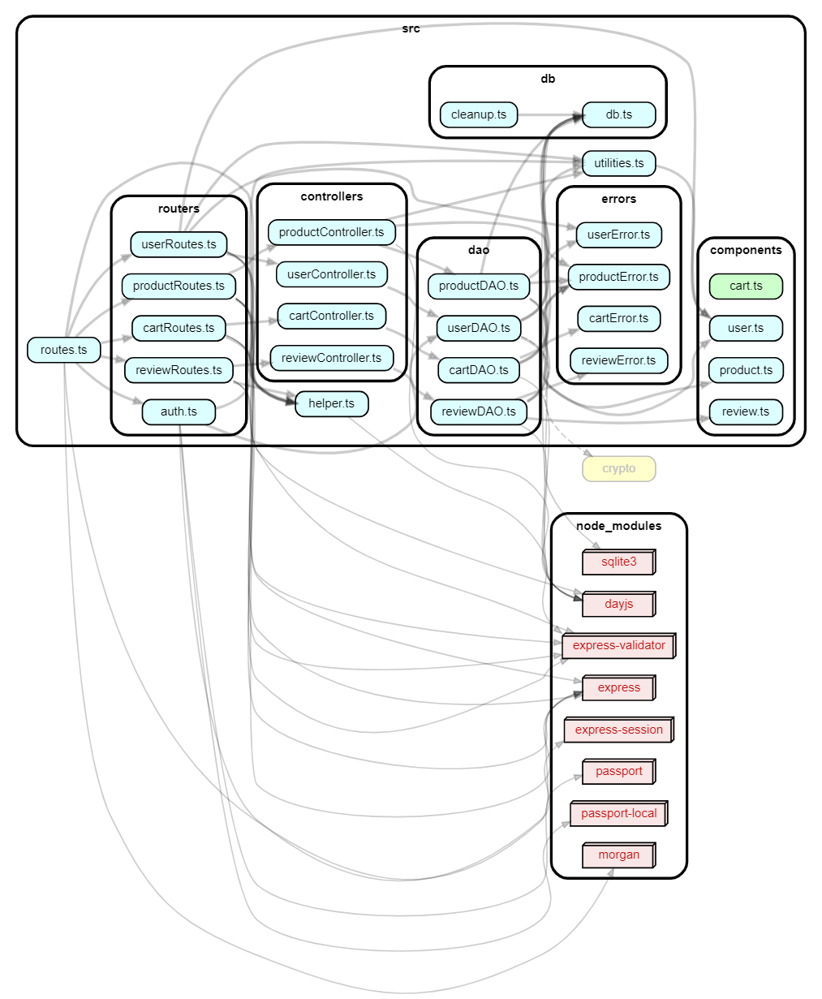
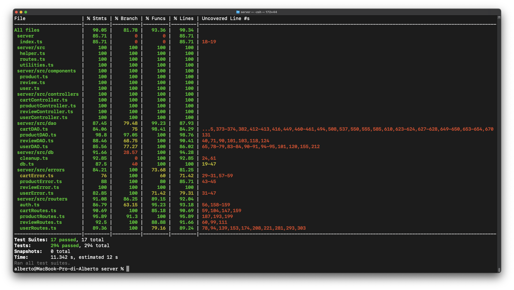

# Test Report

<The goal of this document is to explain how the application was tested, detailing how the test cases were defined and what they cover>

# Contents

- [Test Report](#test-report)
- [Contents](#contents)
- [Dependency graph](#dependency-graph)
- [Integration approach](#integration-approach)
- [Tests](#tests)
- [Coverage](#coverage)
  - [Coverage of FR](#coverage-of-fr)
  - [Coverage white box](#coverage-white-box)

# Dependency graph

# Integration approach

Approch used bottom up :
- step 1 : DAO unit testing
- step : Controller unit testing
- step 3: Route unit testing
- steo 4: Integration functional testing

# Tests

<in the table below list the test cases defined For each test report the object tested, the test level (API, integration, unit) and the technique used to define the test case (BB/ eq partitioning, BB/ boundary, WB/ statement coverage, etc)> <split the table if needed>

| Test case name | Object(s) tested | Test level | Technique used |
| :------------: | :--------------: | :--------: | :------------: |
|It should return true|CreateUser|Controllertests,Unit|White-box (WB),Statement Coverage|
|It should return all users|GetUsers|Controllertests,Unit|WB,Statement Coverage|
|It should return all users with a specific role|getUsersByRole|Controllertests,Unit|WB,Statement Coverage|
|Admin should be able to retrieve any user|getUserByUsername|Controllertests,Unit|WB,Statement Coverage|
|Non admin user should only be able to retrieve their own information|getUserByUsername|Controllertests,Unit|WB,Statement Coverage|
|Admin should be able to delete any user|deleteUser|Controllertests,Unit|WB,Statement Coverage|
|Non admin user should only be able to delete their own account|deleteUser|Controllertests,Unit|WB,Statement Coverage|
|Admin can delete all non-admin users|deleteAll|Controllertests,Unit|WB,Statement Coverage|
|The user can only update their own information|updateUserInfo|Controllertests,Unit|WB,Statement Coverage|
|Admin can update any user's information|updateUserInfo|Controllertests,Unit|WB,Statement Coverage|
|Create a user|createUser|DAOtests,Unit|(WB), Statement Coverage|
|It should return all users|getUsers|DAOtests,Unit|(WB), Statement Coverage|
|It should return all users with a specific role|getUsersByRole|DAOtests,Unit|(WB), Statement Coverage|
|Admin should be able to retrieve any user|getUsersByUsername|DAOtests,Unit|(WB), Statement Coverage|
|Non admin user should only be able to retrieve their own information|getUsersByUsername|DAOtests,Unit|(WB), Statement Coverage|
|Admin should be able to delete any user|DeleteUser|DAOtests,Unit|(WB), Statement Coverage|
|Non admin user should only be able to delete their own account|DeleteUser|DAOtests,Unit|(WB), Statement Coverage|
|Admin can delete all non-admin users|DeleteAll|DAOtests,Unit|(WB), Statement Coverage|
|The user can only update their own information|EditUser|DAOtests,Unit|(WB), Statement Coverage|
|Admin can update any user's information|EditUser|DAOtests,Unit|(WB), Statement Coverage|
|POST request to creat a user: it should return a 200 success code|createUser|RouteTests,Unit|Black-box (BB), Boundary Testing|
|POST request to creat a user: it should return a 422 code, request not valid|createUser|RouteTests,Unit|(BB),Boundary Testing|
|GET request to get all users: it should return a 200 success code|getUsers|RouteTests,Unit|(BB),Boundary Testing|
|GET request to get all users: it should return a 401 code, Not an Admin error|getUsers|RouteTests,Unit|(BB),Boundary Testing|
|GET request to get all users with a specific role: it should return a 200 success code|getUsersByRole|RouteTests,Unit|(BB),Boundary Testing|
|GET request to get all users with a specific role: it should return a 422 code, request not valid|getUsersByRole|RouteTests,Unit|(BB),Boundary Testing|
|GET request to get all users with a specific role: it should return a 401 code, not an Admin error|getUsersByRole|RouteTests,Unit|(BB),Boundary Testing|
|GET request to get a user with a specific username: it should return a 200 success code|getUserByUsername|RouteTests,Unit|(BB),Boundary Testing|
|GET request to get a user with a specific username: it should return a 401 code, User not Admin Error|getUserByUsername|RouteTests,Unit|(BB),Boundary Testing|
|DELETE request to delete his personl account: it should return a 200 success code|deleteUser|RouteTests,Unit|(BB),Boundary Testing|
|DELETE admin request to delete an account: it should return a 200 success code|deleteUser|RouteTests,Unit|(BB),Boundary Testing|
|DELETE customer request to delete an other account: it should return a 401 code, Unauthorized User Error|deleteUser|RouteTests,Unit|(BB),Boundary Testing|
|DELETE admin request to delete an other admin account: it should return a 401 code, User Is Admin Error|deleteUser|RouteTests,Unit|(BB),Boundary Testing|
|DELETE admin request to delete all users: it should return a 200 success code|deleteAll|RouteTests,Unit|(BB),Boundary Testing|
|DELETE no admin request to delete all users: it should return a 401 code, Not Admin Error|deleteAll|RouteTests,Unit|(BB),Boundary Testing|
|PATCH customer request to update his personal information: it should return a 200 success code|updateUserInfo|RouteTests,Unit|(BB),Boundary Testing|
|PATCH admin request to update other user information: it should return a 200 success code|updateUserInfo|RouteTests,Unit|(BB),Boundary Testing|
|PATCH admin request to update other admin user information: it should return a 401 code, User Admin Error|updateUserInfo|RouteTests,Unit|(BB),Boundary Testing|
|PATCH customer request to update other user information: it should return a 401 code, Unauthorized User Error|updateUserInfo|RouteTests,Unit|(BB),Boundary Testing|
|It should return a 200 success code and create a new user|AddUser|Integration test|Black-box Testing, Boundary Testing,Functional Testing|
|It should return a 422 error code if at least one request body parameter is empty/missing|AddUser|Integration test|BB Testing, Boundary Testing,Functional Testing|
|It should return an array of users|GetUsers|Integration test|BB Testing, Boundary Testing,Functional Testing|
|It should return a 401 error code if the user is not an Admin|GetUser|Integration test|BB Testing, Boundary Testing,Functional Testing|
|It should return an array of users with a specific role|GetUser|Integration test|BB Testing, Boundary Testing,Functional Testing|
|It should fail if the role is not valid|GetUsersByRole|Integration test|BB Testing, Boundary Testing,Functional Testing|
|It should return a 401 error code if the user is not an Admin|GetUsersByRole|Integration test|BB Testing, Boundary Testing,Functional Testing|
|It should return a single user with a specific username ADMIN|GetUsersByUsername|Integration test|BB Testing, Boundary Testing,Functional Testing|
|It should return a single user with a specific username CUSTOMER|GetUsersByUsername|Integration test|BB Testing, Boundary Testing,Functional Testing|
|It should return a 401 if a normal user wants to see other user's info|GetUsersByUsername|Integration test|BB Testing, Boundary Testing,Functional Testing|
|It should return a 404 error code if username does not exist|GetUsersByUsername|Integration test|BB Testing, Boundary Testing,Functional Testing|
|It should delete a user with a certain username ADMIN|DeleteUser|Integration test|BB Testing, Boundary Testing,Functional Testing|
|It should delete his self CUSTOMER|DeleteUser|Integration test|BB Testing, Boundary Testing,Functional Testing|
|It should return a 401 if an ADMIN wants to delete another admin|DeleteUser|Integration test|BB Testing, Boundary Testing,Functional Testing|
|It should return a 401 if a normal user wants to delete another admin|DeleteUser|Integration test|BB Testing, Boundary Testing,Functional Testing|
|It should return 404 for a not existing username|DeleteUser|Integration test|BB Testing, Boundary Testing,Functional Testing|
|It should delete all non-Admin user from database|DeleteAllUsers|Integration test|BB Testing, Boundary Testing,Functional Testing|
|It should return a 401 if a user wants to delete all users|DeleteAllUsers|Integration test|BB Testing, Boundary Testing,Functional Testing|
|It should update the personal information of a customer by the customer|UpdateUser|Integration test|BB Testing, Boundary Testing,Functional Testing|
|It should update the personal information of a customer by an admin|UpdateUser|Integration test|BB Testing, Boundary Testing,Functional Testing|
|It should return a 404 error if the username does not exist|UpdateUser|Integration test|BB Testing, Boundary Testing,Functional Testing|
|It should return a 401 error if a user tries to update another user's information|UpdateUser|Integration test|BB Testing, Boundary Testing,Functional Testing|
|It should return a 400 error if the birthdate is after the current date|UpdateUser|Integration test|BB Testing, Boundary Testing,Functional Testing|
|It should return a 401 error if the user is not authenticated|UpdateUser|Integration test|BB Testing, Boundary Testing,Functional Testing|
|It should return success|getUnpaidCartByUserIdController|ControllerTest,Unit|White-box Testing,Statement Coverage|
|It should return errors|getUnpaidCartByUserIdController|ControllerTest,Unit|WB Testing,Statement Coverage|
|It should return success|addToCart|ControllerTest,Unit|WB Testing,Statement Coverage|
|It should return errors|addToCart|ControllerTest,Unit|WB Testing,Statement Coverage|
|It should return success|checkoutCart|ControllerTest,Unit|WB Testing,Statement Coverage|
|It should return errors|checkoutCart|ControllerTest,Unit|WB Testing,Statement Coverage|
|It should return success|getCustomerCarts|ControllerTest,Unit|WB Testing,Statement Coverage|
|It should return success|removeToCart|ControllerTest,Unit|WB Testing,Statement Coverage|
|It should return errors|removeToCart|ControllerTest,Unit|WB Testing,Statement Coverage|
|It should return success|clearCart|ControllerTest,Unit|WB Testing,Statement Coverage|
|It should return errors|clearCart|ControllerTest,Unit|WB Testing,Statement Coverage|
|It should return success|deleteAllCarts|ControllerTest,Unit|WB Testing,Statement Coverage|
|It should return success|getAllCarts|ControllerTest,Unit|WB Testing,Statement Coverage|
|It should return success|addToCart|DAOTest,Unit|White-box Testing e Statement Coverage|
|It should 409 - product with quantity 0|addToCart|DAOTest,Unit|WB Testing,Statement Coverage|
|It should 404 - product doesn't exist|addToCart|DAOTest,Unit|WB Testing,Statement Coverage|
|It should return success|getUnpaidCartByUserIdController|DAOTest,Unit|WB Testing,Statement Coverage|
|It should return success|checkoutCart|DAOTest,Unit|WB Testing,Statement Coverage|
|it should return cart not found because there is no cart|checkoutCart|DAOTest,Unit|WB Testing,Statement Coverage|
|it should return empty cart error because there is a cart but there are no product|checkoutCart|DAOTest,Unit|WB Testing,Statement Coverage|
|it should return empty product stock error because there are 0 product available|checkoutCart|DAOTest,Unit|WB Testing,Statement Coverage|
|it should return empty product stock error because there are 0 product available|checkoutCart|DAOTest,Unit|WB Testing,Statement Coverage|
|It should return success|getCustomerCarts|DAOTest,Unit|WB Testing,Statement Coverage|
|It should return success event with empty cart|getCustomerCarts|DAOTest,Unit|WB Testing,Statement Coverage|
|It should return success|removeToCart|DAOTest,Unit|WB Testing,Statement Coverage|
|It should error, product not found|removeToCart|DAOTest,Unit|WB Testing,Statement Coverage|
|It should error, cart empty|removeToCart|DAOTest,Unit|WB Testing,Statement Coverage|
|It should error, product not in cart|removeToCart|DAOTest,Unit|WB Testing,Statement Coverage|
|It should return success|clearCart|DAOTest,Unit|WB Testing,Statement Coverage|
|It should error, cart not found|clearCart|DAOTest,Unit|WB Testing,Statement Coverage|
|It should return success|deleteAllCarts|DAOTest,Unit|WB Testing,Statement Coverage|
|It should return success|getAllCarts|DAOTest,Unit|WB Testing,Statement Coverage|
|It should return a 200 success code|getCart|RouteTests,Unit| White-box Testing e Statement Coverage|
|It should fail if is not a customer|getCart|RouteTests,Unit|WB Testing,Statement Coverage|
|It should fail if is not logged in|getCart|RouteTests,Unit|WB Testing,Statement Coverage|
|It should return a 200 success code|addToCart|RouteTests,Unit|WB Testing,Statement Coverage|
|should fail if is not a customer|addToCart|RouteTests,Unit|WB Testing,Statement Coverage|
|should fail if is not logged in|addToCart|RouteTests,Unit|WB Testing,Statement Coverage|
|should fail if model is empty|addToCart|RouteTests,Unit|WB Testing,Statement Coverage|
|It should return a 200 success code|checkoutCart|RouteTests,Unit|WB Testing,Statement Coverage|
|should fail if is not a customer|checkoutCart|RouteTests,Unit|WB Testing,Statement Coverage|
|should fail if is not logged in|checkoutCart|RouteTests,Unit|WB Testing,Statement Coverage|
|It should return a 200 success code|getCustomerCarts|RouteTests,Unit|WB Testing,Statement Coverage|
|should fail if is not a customer|getCustomerCarts|RouteTests,Unit|WB Testing,Statement Coverage|
|should fail if is not logged in|getCustomerCarts|RouteTests,Unit|WB Testing,Statement Coverage|
|It should return a 200 success code|removeProductFromCart|RouteTests,Unit|WB Testing,Statement Coverage|
|It should fail with 404 parameter model not speficied|removeProductFromCart|RouteTests,Unit|WB Testing,Statement Coverage|
|should fail if is not a customer|removeProductFromCart|RouteTests,Unit|WB Testing,Statement Coverage|
|should fail if is not logged in|removeProductFromCart|RouteTests,Unit|WB Testing,Statement Coverage|
|It should return a 200 success code|clearCart|RouteTests,Unit|WB Testing,Statement Coverage|
|should fail if is not a customer|clearCart|RouteTests,Unit|WB Testing,Statement Coverage|
|should fail if is not logged in|clearCart|RouteTests,Unit|WB Testing,Statement Coverage|
|It should return a 200 success code|deleteAllCarts|RouteTests,Unit|WB Testing,Statement Coverage|
|should fail if is not a admin|deleteAllCarts|RouteTests,Unit|WB Testing,Statement Coverage|
|should fail if is not logged in|deleteAllCarts|RouteTests,Unit|WB Testing,Statement Coverage|
|It should return a 200 success code|getAllCarts|RouteTests,Unit|WB Testing,Statement Coverage|
|should fail if is not a admin|getAllCarts|RouteTests,Unit|WB Testing,Statement Coverage|
|should fail if is not logged in|getAllCarts|RouteTests,Unit|WB Testing,Statement Coverage|
|Return Empty Cart of logged Customer||Integration test|BB Testing, Boundary Testing,Functional Testing|
|Cannot return cart of logged Admin or Manager||Integration test|BB Testing, Boundary Testing,Functional Testing|
|Add Product to Cart||Integration test|BB Testing, Boundary Testing,Functional Testing|
|Try add product to the cart with quantity 0 should return 409||Integration test|BB Testing, Boundary Testing,Functional Testing|
|Try add product to the card that doesn't exist should return 404||Integration test|BB Testing, Boundary Testing,Functional Testing|
|Try add product to the cart without specify the model||Integration test|BB Testing, Boundary Testing,Functional Testing|
|Try add product to the cart without login||Integration test|BB Testing, Boundary Testing,Functional Testing|
|Checkout current cart|                  |Integration test|BB Testing, Boundary Testing,Functional Testing|
|Try to checkout the cart of the current user that doesn't exist - 404 error|                  |Integration test|BB Testing, Boundary Testing,Functional Testing|
|Try to checkout the cart of the current user that does exist but has no products - 400 error|                  |Integration test|BB Testing, Boundary Testing,Functional Testing|
|Try to checkout the cart of the current user when product is not avaiable (q=0) or quantity is not enough (request < avaiable) - 409 error|                  |Integration test|BB Testing, Boundary Testing,Functional Testing|
|return history of the carts of the user excluded the current cart - 200||Integration test|BB Testing, Boundary Testing,Functional Testing |
|try to return history of the carts of the user that doesn't have one - 200|                  |Integration test|BB Testing, Boundary Testing,Functional Testing|
|try to return history of the carts without permission - 401|                  |Integration test|BB Testing, Boundary Testing,Functional Testing|
|remove one instance of a product in the cart - 200||Integration test|BB Testing, Boundary Testing,Functional Testing|
|try to remove product in a cart that doesn't exists - 404|                  |Integration test|BB Testing, Boundary Testing,Functional Testing |
|try to remove product not present in cart - 404|                  |Integration test|BB Testing, Boundary Testing,Functional Testing |
|try to remove product that doesn't exist from cart - 404|                  |Integration test|BB Testing, Boundary Testing,Functional Testing|
|try to remove product from a empty cart - 400|                  |Integration test|BB Testing, Boundary Testing,Functional Testing|
|try delete without parameter model - 404|                  |Integration test|BB Testing, Boundary Testing,Functional Testing|
|empty the cart - 200|                  |Integration test|BB Testing, Boundary Testing,Functional Testing|
|empty a cart that doesn't exist - 404|                  |Integration test|BB Testing, Boundary Testing,Functional Testing|
|delete cart of all users - 200|                  |Integration test|BB Testing, Boundary Testing,Functional Testing|
|delete cart of all users by Customer - 401|                  |Integration test|BB Testing, Boundary Testing,Functional Testing|
|return all cart of the users current and past - 200|                  |Integration test|BB Testing, Boundary Testing,Functional Testing  |
| Register Product                                            | registerProducts (ProductDAO) | Controller Unit   | WB, Statement Coverage  |
| Change Product Quantity: correctly getting the quantity      | changeProductQuantity (ProductDAO) | Controller Unit   | WB, Statement Coverage              |
| Change Product Quantity: Date error, date in future          | changeProductQuantity (ProductDAO) | Controller Unit   | WB, Statement Coverage              |
| Change Product Quantity: Date error, date before arrival date| changeProductQuantity (ProductDAO) | Controller Unit   | WB, Statement Coverage              |
| Change Product Quantity: Product not found error             | changeProductQuantity (ProductDAO) | Controller Unit   | WB, Statement Coverage              |
| Sell Product: correctly getting the quantity                | sellProduct (ProductDAO)       | Controller Unit   | WB, Statement Coverage              |
| Sell product: Date error, date in future                     | sellProduct (ProductDAO)       | Controller Unit   | WB, Statement Coverage              |
| Sell product: Date error, date before arrival date           | sellProduct (ProductDAO)       | Controller Unit   | WB, Statement Coverage              |
| Sell Product: Empty product stock error                      | sellProduct (ProductDAO)       | Controller Unit   | WB, Statement Coverage              |
| Sell Product: Low product stock error                        | sellProduct (ProductDAO)       | Controller Unit   | WB, Statement Coverage              |
| Sell product: Product not found error                        | sellProduct (ProductDAO)       | Controller Unit   | WB, Statement Coverage              |
| get Products                                                | getProducts (ProductDAO)       | Controller Unit   | WB, Statement Coverage              |
| get Available products                                      | getAvailableProducts (ProductDAO) | Controller Unit   | WB, Statement Coverage              |
| delete Product                                              | deleteProduct (ProductDAO)     | Controller Unit   | WB, Statement Coverage              |
| delete All Products                                         | deleteAllProducts (ProductDAO)  | Controller Unit   | WB, Statement Coverage   |
| correctly registering a new product                 | registerProducts (ProductDAO)| DAO Unit   | WB, Statement Coverage |
| registering a new product : date in future          | registerProducts (ProductDAO)| DAO Unit   | WB, Statement Coverage     |
| registering a new product : failure already registered | registerProducts (ProductDAO)| DAO Unit   | WB, Statement Coverage     |
| registering a new product : generic failure         | registerProducts (ProductDAO)| DAO Unit   | WB, Statement Coverage     |
| correctly updating a product                         | changeProductQuantity (ProductDAO) | DAO Unit   | WB, Statement Coverage     |
| error updating a product                             | changeProductQuantity (ProductDAO) | DAO Unit   | WB, Statement Coverage     |
| correctly get products                               | getProducts (ProductDAO)     | DAO Unit   | WB, Statement Coverage     |
| getProducts: product not found error                 | getProducts (ProductDAO)     | DAO Unit   | WB, Statement Coverage     |
| getProducts: generic failure                         | getProducts (ProductDAO)     | DAO Unit   | WB, Statement Coverage     |
| correctly get available products                    | getAvailableProducts (ProductDAO) | DAO Unit   | WB, Statement Coverage     |
| getAvailableProducts: product not found error       | getAvailableProducts (ProductDAO) | DAO Unit   | WB, Statement Coverage     |
| getAvailableProducts: generic failure               | getAvailableProducts (ProductDAO) | DAO Unit   | WB, Statement Coverage     |
| correctly deleting a product                        | deleteProduct (ProductDAO)   | DAO Unit   | WB, Statement Coverage     |
| error deleting a product                            | deleteProduct (ProductDAO)   | DAO Unit   | WB, Statement Coverage     |
| correctly deleting all products                     | deleteAllProducts (ProductDAO) | DAO Unit   | WB, Statement Coverage     |
| error deleting all products                         | deleteAllProducts (ProductDAO) | DAO Unit   | WB, Statement Coverage     |
| Register product: success 200                      | registerProducts         | Route Testing    | BB Boundary Decision  |
| Register product: 422 model empty                  | registerProducts         | Route Testing    | BB Boundary Decision  |
| Register product: 422 wrong category               | registerProducts         | Route Testing    | BB Boundary Decision  |
| Register product: 422 negative quantity            | registerProducts         | Route Testing    | BB Boundary Decision  |
| Register product: 422 negative sellingPrice        | registerProducts         | Route Testing    | BB Boundary Decision  |
| Register product: 422 wrong date format            | registerProducts         | Route Testing    | BB Boundary Decision  |
| Register product: 401 user not logged in           | registerProducts         | Route Testing    | BB Boundary Decision  |
| Register product: 401 user not admin or manager    | registerProducts         | Route Testing    | BB Boundary Decision  |
| Register product: 409 product already exists       | registerProducts         | Route Testing    | BB Boundary Decision  |
| Register product: 400 impossible date              | registerProducts         | Route Testing    | BB Boundary Decision  |
| Change product quantity: success 200               | changeProductQuantity    | Route Testing    | BB Boundary Decision  |
| Change product quantity: 404 product not found     | changeProductQuantity    | Route Testing    | BB Boundary Decision  |
| Change product quantity: 400 impossible date       | changeProductQuantity    | Route Testing    | BB Boundary Decision  |
| Sell product: success 200                          | sellProduct              | Route Testing    | BB Boundary Decision  |
| Sell product: 404 product not found                | sellProduct              | Route Testing    | BB Boundary Decision  |
| Sell product: 400 impossible date                  | sellProduct              | Route Testing    | BB Boundary Decision  |
| Sell product: 409 low product stock                | sellProduct              | Route Testing    | BB Boundary Decision  |
| Sell product: 409 empty stock                      | sellProduct              | Route Testing    | BB Boundary Decision  |
| get Products: success 200                          | getProducts              | Route Testing    | BB Boundary Decision  |
| get Products: 404 product not found                | getProducts              | Route Testing    | BB Boundary Decision  |
| get Products: 422 grouping null category no        | getProducts              | Route Testing    | BB Boundary Decision  |
| get Products: 422 grouping null model no           | getProducts              | Route Testing    | BB Boundary Decision  |
| get Products: 422 grouping category category null  | getProducts              | Route Testing    | BB Boundary Decision  |
| get Products: 422 grouping category model not null | getProducts              | Route Testing    | BB Boundary Decision  |
| get Available Products: success 200                | getAvailableProducts     | Route Testing    | BB Boundary Decision  |
| get Available Products: 404 product not found      | getAvailableProducts     | Route Testing    | BB Boundary Decision  |
| get Available Products: 422 category not a category| getAvailableProducts     | Route Testing    | BB Boundary Decision  |
| Delete All products: 200 success                   | deleteAllProducts        | Route Testing    | BB Boundary Decision  |
| Delete All products: error                        | deleteAllProducts        | Route Testing    | BB Boundary Decision  |
| Delete product: 200 success                        | deleteProduct            | Route Testing    | BB Boundary Decision  |
| Delete product: 404 product not found              | deleteProduct            | Route Testing    | BB Boundary Decision  |
| Register product: success 200                      |               | Integration test | BB Testing, Boundary Testing, Functional Testing |
| Register product: 422 model empty                  |               | Integration test | BB Testing, Boundary Testing, Functional Testing |
| Register product: 422 wrong category               |               | Integration test | BB Testing, Boundary Testing, Functional Testing |
| Update product quantity: success 200               |               | Integration test | BB Testing, Boundary Testing, Functional Testing |
| Update product quantity: 422 model empty           |               | Integration test | BB Testing, Boundary Testing, Functional Testing |
| Update product quantity: 404 model not found       |               | Integration test | BB Testing, Boundary Testing, Functional Testing |
| Sell product: success 200                          |               | Integration test | BB Testing, Boundary Testing, Functional Testing |
| Sell product: 404 product not found                |               | Integration test | BB Testing, Boundary Testing, Functional Testing |
| Sell product: 409 insufficient quantity            |               | Integration test | BB Testing, Boundary Testing, Functional Testing |
| Get all products: success 200                      |               | Integration test | BB Testing, Boundary Testing, Functional Testing |
| Get products by category: success 200              |               | Integration test | BB Testing, Boundary Testing, Functional Testing |
| Get products by model: success 200                 |               | Integration test | BB Testing, Boundary Testing, Functional Testing |
| Get products: 422 model + category                 |               | Integration test | BB Testing, Boundary Testing, Functional Testing |
| Get products: 422 model given category             |               | Integration test | BB Testing, Boundary Testing, Functional Testing |
| Get products: 422 category given model             |               | Integration test | BB Testing, Boundary Testing, Functional Testing |
| Get products: 422 category no category             |               | Integration test | BB Testing, Boundary Testing, Functional Testing |
| Get products: 422 model no model                   |               | Integration test | BB Testing, Boundary Testing, Functional Testing |
| Get products: 404 model not found                  |               | Integration test | BB Testing, Boundary Testing, Functional Testing |
| Get available products: success 200                |               | Integration test | BB Testing, Boundary Testing, Functional Testing |
| Delete product: success 200                        |               | Integration test | BB Testing, Boundary Testing, Functional Testing |
| Delete product: model not found                    |               | Integration test | BB Testing, Boundary Testing, Functional Testing |
| Delete product: 422 empty model                    |               | Integration test | BB Testing, Boundary Testing, Functional Testing |
| Delete all products: success 200                    |               | Integration test | BB Testing, Boundary Testing, Functional Testing |
| Error deleting all products: 400                    |               | Integration test | BB Testing, Boundary Testing, Functional Testing |
| It should add a new review for a product       | addReview                  | Controller Review | WB                                      |
| It should show the reviews of a product        | getProductReviews          | Controller Review | WB                                      |
| It should delete a review                      | deleteReview               | Controller Review | WB                                      |
| It should delete all reviews for a product     | deleteReviewsOfProduct     | Controller Review | WB                                      |
| It should delete all reviews                   | deleteAllReviews           | Controller Review | WB                                      |
| It should add a new review for a product                   | addReview                        | DAO Unit   | WB             |
| It should show the reviews of a product                    | getProductReviews                | DAO Unit   | WB             |
| It should delete a review                                  | deleteReview                     | DAO Unit   | WB             |
| It should delete all reviews for a product                 | deleteReviewsOfProduct           | DAO Unit   | WB             |
| It should delete all reviews                               | deleteAllReviews                 | DAO Unit   | WB             |
| addReview: should throw ProductNotFoundError if product does not exist | getProduct                      | DAO Unit   | WB             |
| addReview: should throw ExistingReviewError if review already exists | addReview                      | DAO Unit   | WB             |
| getProductReviews: should throw NoReviewProductError if review does not exist | getProductReviews             | DAO Unit   | WB             |
| It should add a new review for a product              | addReview             | Route Unit   | BB (Boundary Decision)   |
| It should show the reviews of a product              | getProductReviews     | Route Unit   | BB (Boundary Decision)   |
| It should delete a review                            | deleteReview          | Route Unit   | BB (Boundary Decision)   |
| It should delete all reviews for a product           | deleteReviewsOfProduct| Route Unit   | BB (Boundary Decision)   |
| It should delete all reviews                         | deleteAllReviews      | Route Unit   | BB (Boundary Decision)   |
| Parameter model is an empty string                   | addReview             | Route Unit   | BB (Boundary Decision)   |
| Body comment is an empty string                      | addReview             | Route Unit   | BB (Boundary Decision)   |
| Body score is a wrong number                        | addReview             | Route Unit   | BB (Boundary Decision)   |
| 401 user not logged in                              | addReview             | Route Unit   | BB (Boundary Decision)   |
| 401 user not customer                               | addReview             | Route Unit   | BB (Boundary Decision)   |
| 401 user not logged in                              | getProductReviews     | Route Unit   | BB (Boundary Decision)   |
| 401 user not logged in                              | deleteReview          | Route Unit   | BB (Boundary Decision)   |
| 401 user not customer                               | deleteReview          | Route Unit   | BB (Boundary Decision)   |
| 401 user not admin or manager                       | deleteReviewsOfProduct| Route Unit   | BB (Boundary Decision)   |
| getProductReviews: should throw NoReviewProductError | getProductReviews     | Route Unit   | BB (Boundary Decision)   |ù
| should return a 200 success code and add the review to the specified product |           | Integration   | BB Testing, Boundary Testing, Functional Testing |
| should return a 409 error if the review data is duplicated                 |           | Integration   | BB Testing, Boundary Testing, Functional Testing |
| should return ProductNotFound if the product does not exist                |           | Integration   | BB Testing, Boundary Testing, Functional Testing |
| Try add review without login                                              |           | Integration   | BB Testing, Boundary Testing, Functional Testing |
| should return a 422 code if the review is not valid (comment is an empty string) |           | Integration   | BB Testing, Boundary Testing, Functional Testing |
| should return a 422 code if the review is not valid (model is an empty string) |           | Integration   | BB Testing, Boundary Testing, Functional Testing |
| should return a 200 success code and the reviews for the specified product |           | Integration   | BB Testing, Boundary Testing, Functional Testing |
| should return an empty array error if the product does not exist           |           | Integration   | BB Testing, Boundary Testing, Functional Testing |
| should return a 200 success code and remove the review                      |           | Integration   | BB Testing, Boundary Testing, Functional Testing |
| should throw ProductNotFoundError if the model provided does not exist    |           | Integration   | BB Testing, Boundary Testing, Functional Testing |
| should return a 200 success code and remove all reviews                     |           | Integration   | BB Testing, Boundary Testing, Functional Testing |
| should return a 401 Unauthorized if the user is not admin or manager       |           | Integration   | BB Testing, Boundary Testing, Functional Testing |
| should return a 200 success code and remove all reviews                     |           | Integration   | BB Testing, Boundary Testing, Functional Testing |

# Coverage

## Coverage of FR

<Report in the following table the coverage of functional requirements and scenarios(from official requirements) >

| Functional Requirement or scenario |                                                                                                                                    Test(s)                                                                                                                                    |
| :--------------------------------: | :---------------------------------------------------------------------------------------------------------------------------------------------------------------------------------------------------------------------------------------------------------------------------: |
|             ***FR1***              |                                                                                                                                                                                                                                                                               |
|               FR1.1                |                                                                                                      - POST /sessions with valid credentials should return 200 (success)   - getIsUserAuthenticated - Authenticate a user     - getIsUserAuthenticated - Handle database error    - getIsUserAuthenticated - Handle user not found error                 - getIsUserAuthenticated - Handle missing salt error    - getIsUserAuthenticated - Handle password mismatch error                                                                        |
|               FR1.2                |                                                                                                                                                                                                                                                                               |
|               FR1.3                |  - function: createUser should return true - POST /users should return 200 (success) and create a new user - POST /users with empty/missing parameter(s) should return 422 (error) - POST /users with existing username should return 409 (error)   - createUser - Handle database error   - createUser - Handle unique constraint error   - createUser - Handle crypto error |
|             ***FR2***              |                                                                                                                                                                                                                                                                               |
|               FR2.1                | - GET request to get all users: it should return a 200 success code - GET request to get all users: it should return a 401 code, Not an Admin error - GET request to get all users with a specific role: it should return a 200 success code - GET request to get all users with a specific role: it should return a 422 code, request not valid - GET request to get all users with a specific role: it should return a 401 code, not an Admin error - GET request to get a user with a specific username: it should return a 200 success code - GET request to get a user with a specific username: it should return a 401 code, User not Admin Error  - GetUsers - Retrieve all users   - GetUsers - Handle database error   - GetUsers - Handle invalid filter value   - getUsers	- It should return all users   - GET /users	- It should return an array of users   - GET /users - It should return a 401 error code if the user is not an Admin
|               FR2.2                | - GET request to get all users with a specific role: it should return a 200 success code   - GET request to get all users with a specific role: it should return a 422 code, request not valid - GET request to get all users with a specific role: it should return a 401 code, not an Admin error   - GetUsers - Retrieve users by role   - getUsersByRole	- It should return all users with a specific role   - GET /users/roles/ - It should return an array of users with a specific role   - GET /users/roles/ - It should fail if the role is not valid  - GET /users/roles/  - It should return a 401 error code if the user is not an Admin|
|               FR2.3                | - GET request to get a user with a specific username: it should return a 200 success code - GET request to get a user with a specific username: it should return a 401 code, User not Admin Error   - GetUserByUsername - Retrieve user by username   - getUserByUsername - Handle database error   - getUserByUsername - Handle user not found error   - getUserByUsername	- Admin should be able to retrieve any user   -  getUserByUsername - Non-admin user should only be able to retrieve their own information   - GET /users/ - It should return a single user with a specific username (ADMIN)   - GET /users/ - It should return a single user with a specific username (CUSTOMER)   - GET /users/ - It should return a 401 if a normal user wants to see other user's info   - GET /users/ - It should return a 404 error code if username does not exist|
|               FR2.4                | - PATCH customer request to update his personal information: it should return a 200 success code - PATCH admin request to update other user information: it should return a 200 success code - PATCH admin request to update other admin user information: it should return a 401 code, User Admin Error - PATCH customer request to update other user information: it should return a 401 code, Unauthorized User Error   - EditUser - Edit user details   - updateUserInfo	- The user can only update their own information   - updateUserInfo - Admin can update any user's information   - PATCH /users/ - It should update the personal information of a customer by the customer  - PATCH /users/ - It should update the personal information of a customer by an admin  - PATCH /users/ - It should return a 404 error if the username does not exist  - PATCH /users/ - It should return a 401 error if a user tries to update another user's information  - PATCH /users/ - It should return a 400 error if the birthdate is after the current date  - PATCH /users/ - It should return a 401 error if the user is not authenticated|
|        FR2.5               |  - DELETE request to delete his personal account: it should return a 200 success code - DELETE admin request to delete an account: it should return a 200 success code - DELETE customer request to delete an other account: it should return a 401 code, Unauthorized User Error - DELETE admin request to delete an other admin account: it should return a 401 code, User Is Admin Error - DELETE admin request to delete all users: it should return a 200 success code - DELETE no admin request to delete all users: it should return a 401 code, Not Admin Error DeleteUser - Delete a user by username   - DeleteAll - Delete all users except Admin   - deleteUser	- Admin should be able to delete any user   - deleteUser - Non-admin user should only be able to delete their own account   - DeleteUser - Handle database error   - DeleteUser - Handle user not found error   - DELETE /users/ - It should delete a user with a certain username (ADMIN)  - DELETE /users/ - It should delete his self (CUSTOMER)  - DELETE /users/ - It should return a 401 if an ADMIN wants to delete another admin  - DELETE /users/ - It should return a 401 if a normal user wants to delete another admin  - DELETE /users/ - It should return 404 for a not existing username|
|               FR2.6                |     - DeleteAll - Delete all users except Admin   - DeleteAll - Handle database error   - DeleteAll - Handle connection error   - deleteAll	- Admin can delete all non-admin users   - DELETE /users	- It should delete all non-Admin users from the database    - DELETE /users - It should return a 401 if a user wants to delete all users|
| ***FR3*** ||
| FR3.1 |    - Register product: success 200   - Register product: 422 model empty   - Register product: 422 wrong category   - Register product: 422 negative quanitity   - Register product: 422 negative sellingPrice   - Register product: 422 wrong date format   -  Register product: 401 user not logged in   - Register product: 401 user not admin or manager   - Register product: 409 product already exists   - Register product: 400 impossible date   - correctly registering a new product   - registering a new product : date in future   - registering a new product : failure already registered   - registering a new product : generic failure   - Register Product   - "POST `ezelectronics/products' - 200 :correctly adding a product - 422 : fake date - 401 : not logged in user - 401 : user is customer - 409 : model already existing - 400 : date in future|
| FR3.2 |   - Change product product: success 200   - Change product product: 404 product not found   - Change product quantity: 400 impossible date   -correctly updating a  product   - error updating a  product   - Change Product Quantity: correctly getting the quantity   - Change Product Quantity: Date error, date in future   - Change Product Quantity: Date error, date before arrival date   - Change Product Quantity: Product not found error   - PATCH "ezelectronics/products/:model" - 200 :correctly updating product quantity - 422 : model empty - 404 : model not found - 400 : date before arrival|
| FR3.3 |    - Sell product: success 200   - Sell product: 404 product not found   - Sell product: 400 impossible date   - Sell product: 409 low product stock   - Sell product: 409 empty stock   - Sell Product: correctly getting the quantity   - Sell product: Date error, date in future   - Sell product: Date error, date before arrival date   - Sell Product: Empty product stock error -   Sell product: Product not found error   - PATCH "ezelectronics/products/:model/sell" - 200 :correctly selling product - 404 : product not found - 409 : product quaniity 0 - 409 : product quaniity less than requested |
| FR3.4 |   - get Products: success 200   - get Available Products: success 200   - get Available Products: 404 product not found   - correctly get products   - getProducts: product not found error   - getProducts: generic faillure   - correctly get available products   - getAvailableProducts: product not found error   - getAvailableProducts: generic faillure   - get Products   - GET "ezelectronics/products/available" - 200 : getting available products |
| FR3.5 |   - get Products: 422 grouping null category no   - "get Products: 422 grouping category category null   - get Products: 422 grouping category model not null   - get Available Products: 422 category not a category   - GET "ezelectronics/products" - 200 : grouping category - 200 : grouping model - 422 : model + category - 422 : grouping model given category -  422 : grouping category given model - 422 : grouping category no category - 422 : no grouping category - 422 : no grouping model - 404 : model not found|
| FR3.6 |   - get Products: 422 grouping null model no - 422 : grouping model no model|
| FR3.7 |   - Delete product: 200 success   - Delete product: 404 product not found   - correctly deleting a  product   -error deleting a  product   - delete Product   - DELETE "ezelectronics/products/:model" - correctly deleting - model to delete not found |
| FR3.8 |   - Delete All products: 200 success   - Delete All products: error   - correctly deleting all products   - error deleting all products   - delete All Products   - DELETE "ezelectronics/products" correctly deleting  |
| ***FR4*** ||
| FR4.1 |   - AddReview: 200 success   - 409 user already reviewed product   - 404 product not found   - 401 user not logged   - 422 empty review code    - 422 empty comment  - POST "ezelectronics/reviews/:model"|
|FR4.2|	  - GetReviews: 200 success with reviews   - 200 success with empty array for non-existing product  - GET "ezelectronics/reviews/|
|FR4.3|	  - DeleteReview: 200 success   - 404 product not found  - DELETE ezelectronics/reviews/:model|
|FR4.4|	  - DeleteAllReviewsOfProduct: 200 success   - 401 unauthorized  - DELETE "ezelectronics/reviews/:model/all"|
|FR4.5|	  - DeleteAllReviews: 200 success  - DELETE "ezelectronics/reviews"|
| ***FR5*** ||
| FR5.1 |   - GetCart: 200 success for logged customer with empty cart   - 401 unauthorized for admin or manager  - GET "/carts" |
| FR5.2 |   - AddProductToCart: 200 success   - 409 product quantity 0   - 404 product not found   - 422 model not specified   - 401 user not logged  - POST "/carts" |
| FR5.3 |   - GetCartHistory: 200 success with cart history   - 200 success with empty history   - 401 unauthorized for non-customer  - GET "/carts/history" |
| FR5.4 |   - RemoveProductFromCart: 200 success   - 404 cart not found   - 404 product not in cart   - 404 product not found   - 400 empty cart   - 422 model not specified  - DELETE "/carts/products/|
| FR5.5 |   - EmptyCart: 200 success   - 404 cart not found  - DELETE "/carts/current" |
| FR5.6 |   - DeleteCartsOfAllUsers: 200 success for admin or manager   - 401 unauthorized for customer  - DELETE "/carts" |
| FR5.7 |   - GetAllCarts: 200 success  - GET "/carts/all" |
## Coverage white box

Report here the screenshot of coverage values obtained with jest-- coverage

