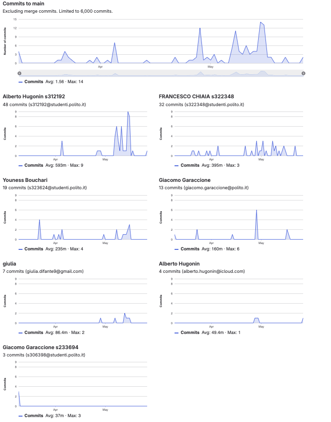

# Gruppo 34

## Valutazione deliverable V1

| gruppo | context diagram | business model | stakeholder | stories | interface | FR | NFR | use cases diagram | use cases | scenario | Glossary | DeploymentDiagram | functionality | estimation doc | precisione valori estimation | valutazione |
| --- | --- | --- | --- | --- | --- | --- | --- | --- | --- | --- | --- | --- | --- | --- | --- | --- |
| - | 1 | 0.5 | 0.5 | 1 | 1 | 3 | 3 | 1 | 5 | 5 | 5 | 2 | 1 | 2 | 2 | 33 |
| 34 | 95 | 100 | 95 | 100 | 95 | 100 | 100 | 100 | 100 | 100 | 95 | 100 | 100 | 90 | 88.73 | 99.1 |

## Valutazione deliverable V2

| gruppo | context diagram | business model | stakeholder | stories | interface | FR | NFR | ACCESS RIGHTS | use cases diagram | use cases | scenario | Glossary | DeploymentDiagram | functionality | estimation | precisione valori estimation | valutazione |
| --- | --- | --- | --- | --- | --- | --- | --- | --- | --- | --- | --- | --- | --- | --- | --- | --- | --- |
| - | 1 | 0.5 | 0.5 | 1 | 1 | 3 | 2 | 1 | 1 | 5 | 5 | 5 | 2 | 1 | 2 | 2 | 33 |
| 34 | 100 | 100 | 100 | 100 | 100 | 100 | 100 | 0 | 100 | 100 | 100 | 100 | 100 | 100 | 100 | 92.74 | 98.06 |

Le percentuali di v2 sono state riscalate in quanto la media pesata delle percentuali portava alcuni gruppi oltre al 100%.

## Valutazione codice e test (V2 + V3)

| Test Unit Totali | Test Unit Passati | Statement Coverage Unit | Branch Coverage Unit | Function Coverage Unit | Line Coverage Unit | Test Integration Totali | Test Integration Falliti | Statement Coverage Integration | Branch Coverage Integration | Function Coverage Integration | Line Coverage Integration | Correttezza V2 | Correttezza V3 | valutazione |
| --- | --- | --- | --- | --- | --- | --- | --- | --- | --- | --- | --- | --- | --- | --- |
| 1 | 0.5 | 2 | 2 | 1 | 1 | 1 | 0.5 | 2 | 2 | 1 | 1 | 16 | 2 | 33 |
| 75 | 100 | 100 | 75 | 100 | 100 | 75 | 100 | 100 | 75 | 100 | 100 | 95.7983193277311 | 100 | 93.42 |

 Unit e integration test prodotti dai gruppi sono stati eseguiti con la versione V2 del codice.

## Risultati Progetto

| Deliverable | Punteggio | Peso |
| --- | --- | --- |
| **Documenti V1** | 99.1% | 6 |
| **Documenti V2** | 96.74% | 2 |
| **Codice e Test** | 93.42% | 22 |
| **Timesheet** | 66.66% | 3 |
| **Valutazione** | 30.43 | 33 |
| **Valutazione** | 12.17 | 13.2 |

## Calcolo pesi progetto per singolo studente

| cognome | nome | email | gruppo | commit studente | commit totali | commit sul totale | coefficiente catme | coefficiente pesato | coefficiente progetto |
| --- | --- | --- | --- | --- | --- | --- | --- | --- | --- |
| BOUCHARI | YOUNESS | s323624@studenti.polito.it | 34 | 19 | 110 | 0.17 | 1.00 | 0.83 | 0.93 |
| CHIAIA | FRANCESCO | s322348@studenti.polito.it | 34 | 32 | 110 | 0.29 | 1.05 | 0.90 | 1.00 |
| DI FANTE | GIULIA | s331555@studenti.polito.it | 34 | 7 | 110 | 0.06 | 1.00 | 0.81 | 0.90 |
| HUGONIN | ALBERTO | s312192@studenti.polito.it | 34 | 52 | 110 | 0.47 | 1.00 | 0.89 | 1.00 |

 I pesi del progetto sono ottenuti per l'80% dal valore calcolato da CATME e per il 20% dalla percentuale dei commit del singolo studente sul totale dei commit effettuati dagli studenti dello stesso gruppo. Il risultato è stato poi riscalato in modo che il punteggio più alto del gruppo ottenesse 1.

## Studenti

| Nome | Matricola | Email | Bonus | Voto Primo Appello | Voto Secondo Appello | Voto Progetto | Voto Finale |
| --- | --- | --- | --- | --- | --- | --- | --- |
| FRANCESCO CHIAIA | 322348 | s322348@studenti.polito.it | 1 | 16.64 | | 12.17 | 30 |
| YOUNESS BOUCHARI | 323624 | s323624@studenti.polito.it | 1 | 16.65 | | 11.31 | 29 |
| ALBERTO HUGONIN | 312192 | s312192@studenti.polito.it | 0 | 12.8 | | 12.12 | 25 |
| GIULIA DI FANTE | 331555 | s331555@studenti.polito.it | 1 |  | 11.7 | 11.01 | 24 |
